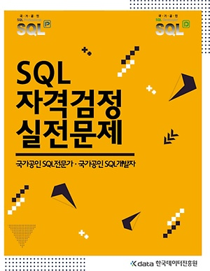
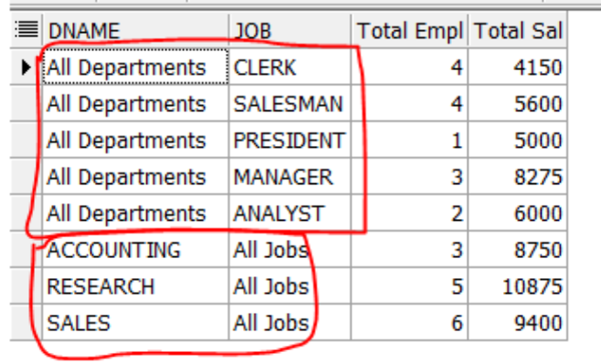

# SqlD 준비 과정 및 후기

안녕하세요 Jams & Donguk의 Donguk입니다.

이번 9월 4일에 Sqld 시험을 봤는데 합격할 것 같아서 미리 합격 후기 및 과정을 설명드리려 합니다.

준비기간은 1달이었으며 Sqld같은 경우에는 SQL 고급 활용 및 튜닝 문제가 나오지 않기 때문에 쉽다고 알고 있습니다만

올해 2월에 공부 안 하고 낙방했던 기억이 있습니다. 공부 꼭 하고 시험 보세요~

## 준비 과정

### 준비 기간

2021년 8월 4일 ~ 9월 4일( > 시험 당일)

### 준비 시 사용한 책


준비 시에는 SQL자격 검정 실전 문제집(통칭 노랭이)를 이용해 준비했습니다.

정보처리기사 자격증을 취득했던 경험을 살려 문제 위주로 접근하기 위해 문제집을 사서 진행했습니다.

문제는 총 6번을 풀었으며 각 회수별로 어떤 생각으로 접근했는지 설명드리겠습니다.


### 1회차
본인은 정보처리 기사 준비 외에 따로 sql을 공부한 적은 없었으며

프로젝트 시 최소한의 sql만을 사용해봤기 때문에 union같은 것들도 따로 사용해본 경험은 없었습니다.

그래서 문제를 풀 때 모르는 개념이 나오면 정리를 해가면서 풀어나갔습니다.

처음 문제를 풀 때는 하루 **30문제씩** 풀며 몰랐던 개념들을 정리해나갔습니다.

이 때 정답 체크는 아예 하지 않았습니다.(거의 절반은 틀리는 수준이었으므로...)

[정리했던 내용] : https://torpid-handstand-ca9.notion.site/SQLD-98784a936341433cbcf5cc04e2898d35

(위 내용은 저만 알알 볼 수 있게 막 정리한 것이라 참고만 해주세요~ 블로그로 정리해서 옮길 수 있으면 옮기겠습니다.)


### 2회차
2회차는 1회차에 문제를 풀고 정리해봤기 때문에 **60문제씩** 풀기 시작했습니다.

정리는 따로 하지 않았으며 문제를 풀 때 잊어버린 개념들에 대해 정답 체크 전 미리 적어두고

정답 체크 후에는 오답과 함께 적어둔 개념을 다시 확인해 보는 방식으로 접근했습니다.


### 3회차
3회차도 동일하게 **60문제씩** 풀어나갔으며 푸는 방식을 2회차와 동일하게 모르는 내용을 밑에 적으며 풀었습니다.

이 때 부터는 3번이나 풀었음에도 틀리는 문제들이기 때문에 확실하게 이해가 되지 않아 틀렸다는 생각으로 접근해

완벽하게 이해가 가지 않은 문제들을 기준으로 오답노트를 작성했습니다.

또한 답안지 답들과 친해지는 시점입니다. 답안지 내용도 대부분 정리하기 시작합니다.


### 4회차
4회차 부터는 웬만한 답들은 이미 알고 있는 상태가 되었기 때문에

쉬운 부분은 하루 ***100문제씩*** 풀었으며 어려운 부분에서 ***60문제씩*** 풀었습니다.

이 때 부터는 모르는 개념들은 거의 없었으며 단순 암기가 필요한 것들이 있기 때문에(명령어, 함수명 등등)

이런 내용들은 일부러 안 보지않고 손으로 써보고, 읽고, 풀고 나서 답 체크 후 다시 보고 하면서 외우는데 집중했습니다.

이 때도 틀리는 내용이 나오는데 이는 3회차에 다시 봤음에도 이해가 마찬가지로 되지 않은 내용이라 좀더 깊게 파서 공부했습니다.

이 때가 되면 더 많은 문제를 풀었지만 깊게 파고 공부해도 오히려 시간이 남거나 비슷합니다.


### 5회차
몇 문제씩 풀었는지 기억은 안 나지만 토, 일 2일간 문제를 다 풀었습니다.

이제부터 틀리지 않습니다.

하지만 이슈가 있다면 문제 답은 알지만 해당 문제에 사용된 유형의 개념들이 안 외워지는 부분이 존재합니다.

때문에 안 외워지거나 조금 있으면 잊어버릴 것 같은 나만의 내용들에 집중해서 암기하는 기분으로 해당 개념 문제를 접근합니다.


### 6회차
2일만에 마찬가지로 다 풀고 틀리지 않습니다.

이 쯤되면 그냥 빨리 시험 보고싶습니다.

어차피 붙을 것 같고 굳이 더 봐야하나 싶지만 제가 못했던 부분을 설명드리자면

이 때 Rollup, Cube, Grouping Sets를 아무것도 안 보고 Group by절에 작성하는 연습을 하십시요

저 주관식에 저 문제가 손으로 쓰는 방식이나와 당황해서 Rollup, Cube 쓰면 되는데

굳이 기억나는 Grouping Sets 하나로 풀었던 기억이 있습니다.(두 개는 문제를 안 보니까 사용방법이 기억이 안 났던...)


### 시험 하루 전
시험 직전에는 2가지정도를 다시 한번 체크해보시고 시험보시면 될 것 같습니다.

* Group By절에 사용되는 함수들(Rollup, Cube, Grouping Sets)를 어떻게 사용하는지 각각의 특징은 무엇인지 확인

* 각 함수들에서 컬럼을 조합하게 되면 어떤 식으로 결과값이 도출되는지 확인

  예를 들어
  ```sql
  SELECT
  	DECODE(GROUPING(DNAME),1,'ALL DEPARTMENTS',DNAME) AS DNAME,
  	DECODE(GROUPING(JOB),1,'ALL JOB',JOB) AS JOB,
  	COUNT(*) 'TOTAL EMPL',
  	SUM(SAL) 'TOTAL SAL'
  FROM EMP E, DEPT D
  WHERE E.DEPTNO = D.DEPTNO
  GROUP BY GROUPING SETS(DNAME,JOB)
  ```
  위와 같은 쿼리가 있을 때 결과값은 아래와 같이 묶여 나온다는 감을 가져야함

  


## 후기
위와 같이 준비하시면 문제를 보셨을 때 어? 이거 문제집에 있던 문젠데? 하는게 3개 이상은 나옵니다.

또한 문제집에서 지문만 바꾼 것 같은 내용의 문제는 20개 정도는 나옵니다.

그래서 떨어질 것 같은 생각이 안 드실 겁니다. 목표를 80점으로 잡고 공부하시면 넉넉하게 합격하실 것으로 생각됩니다.

다들 화이팅 하시고 꼭 시험 붙으시길 바라겠습니다. 뿅~
