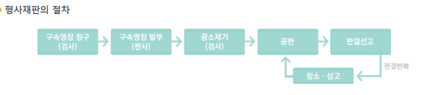
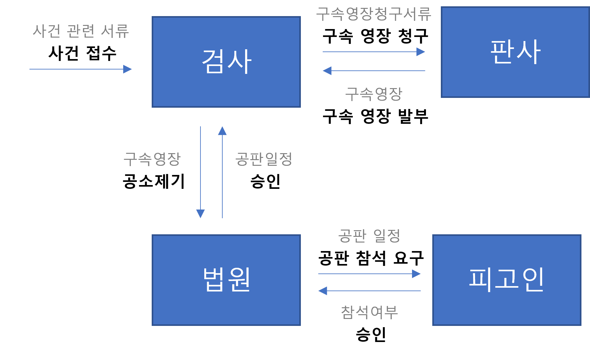
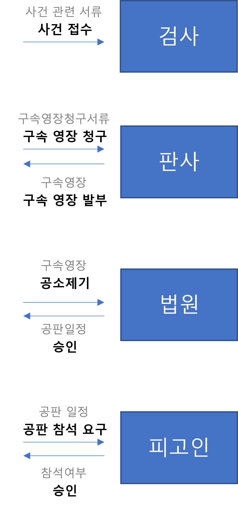

## 객체지향의 사실과 오해
안녕하세요 Jams & Donguk의 **Donguk**입니다

최근에 읽은 **<strong style="color: #bb4177;">'객체지향의 사실과 오해'</strong>**라는 책을 읽고 느낀점이 많아 내용을 공유하기 위해 블로그 포스팅을 진행하게 되었습니다.

본 포스팅은 **Java**를 기준으로 설명할 것이기 때문에 클래스, 메서드 등과 같은 개념을 아직 모르시는 분들에게는 친절한 포스팅이 아닐 수 있습니다.

### 읽게된 계기
현재 다니고 있는 회사는 웹 서비스를 제작하는 SI 회사입니다

회사 특성상 프리랜서분들이 많고 개발 기간 자체가 촉박하다 보니 협업을 진행함에 있어 어려움이 많습니다.

특히 코드를 작성하는 룰을 구축해도 새로 유입되는 프리랜서분들에 의해 룰이 깨지는 경우가 많았고 그 결과 코드의 가독성이 떨어졌습니다.

최근 Java를 활용한 프로젝트도 1차 개발이 완료되면서 하드코딩된 내용을 리팩터링하는 작업을 진행하려 했지만 이미 완성된 프로젝트를 리팩토링하는 행위 자체가 정상 작동하던 시스템에 오류를 야기할 수 있어 부담이 적지 않은 작업이었습니다.

때문에 프로젝트 초기 누구나 이해하기 쉽게 아키텍처를 잡아야 한다는 사실을 느끼고 주변 고급 개발자분들에게 아키텍처 관련 서적을 추천 받았습니다.

책은 **'객체지향의 사실과 오해', '오브젝트'** 두 권을 추천받았습니다.

**'객체지향의 사실과 오해'는 객체지향 자체의 의의와 객체지향적인 사고에 대한 내용을 주로 다루고 있으며 오브젝트는 이를 활용해 설계를 어떻게 진행할지에 초점이 맞춰져있습니다.**

때문에 먼저 객체지향의 사실과 오해를 통해 객체지향이 지향하는 설계 방식이 무엇인지 넓고 얕게 확인해 보고 다음 오브젝트를 통해 설계를 조금 더 딥하게 공부해 보도록 하겠습니다.


### 저자
객체지향의 사실과 오해, 오브젝트 두 권의 책 모두 현 우아한형제들 개발실장 조영호님이 저서한 책으로 객체지향관점의 설계가 어떻게 구현되어야 하는지를 다루고 있습니다

조영호님은 현재 책 외에도 블로그, 우아한 테크 세미나, 토비의 스프링 유튜브 등에 출연하시며 소통을 하고 있으니 경험해보시면 좋을 것 같습니다

다음에 저도 기회가 되면 세미나에 직접 참여해 보고 싶습니다

1. <a href="http://aeternumeglooscom/">조영호님 블로그</a>

2. <a href="https://youtube/dJ5C4qRqAgA">우아한테크세미나</a>

3. <a href="https://wwwyoutubecom/watch?v=8OclN9kZTE4">토비의스프링유튜브</a>


## 책 소개
객체지향의 사실과 오해는 객체지향을 분석하고 **<strong style="color: #bb4177;">역할, 책임, 협력</strong>** 관점으로 나누어 설명하고 있습니다

지금부터 역할, 책임, 협력이란 무엇이고 일반적인 개발자들이 가지고 있는 객체지향의 오해는 무엇이며 저자가 말하고 있는 사실이란 무엇인지 알아보도록 하겠습니다


### 역할이란?
객체지향은 **객체를 지향하는 언어**입니다

객체란 현실 세계의 것을 반영하여 코드로 충분히 추상화 시켜놓은 대상체입니다

때문에 **현실 속에서 존재하는 역할을 응당 코드 속에서도 해당 객체가 담당**해야 합니다.

예를 들어 법정을 객체지향적으로 구현한다고 가정해 보겠습니다.

법정 안에는 다양한 객체들이 존재합니다만 크게 판사 객체, 검사 객체, 피고인 객체, 변호사 객체가 존재한다고 가정하겠습니다.

각각의 객체는 모두 **담당해야 하는 역할**이 정해져있습니다.

- **검사** 객체는 피고인에게 죄가 있다는 것을 증명하고 그에 따라 형량을 제시하는 역할을 담당합니다.

- **변호사** 객체는 피고인이 무고하다는 것을 증명하고 그에 따라 피고인이 최소한의 법적 판결을 받도록 하는 역할을 담당합니다.

- **판사** 객체는 검사가 제시한 형을 판단해 합당한지 하지 않은지를 결정하는 역할을 담당하며 피고인을 판결하는 역할을 담당합니다.

하지만 위 관계에서 각 객체가 다른 객체의 역할을 침범한다면 어떤 상황이 발생할까요?

**검사가 판사의 역할을 대신하게 될 경우** 피고인은 죄가 없는 경우에도 죄인이 될 가능성 **즉, 오류가 생길 가능성**이 존재합니다.

마찬가지로 **변호사가 판사의 역할을 대신하게 될 경우** 죄가 있는 경우에도 무고한 사람이 될 수 있습니다.

따라서 각각의 **<strong style="color: #bb4177;">객체는 자신이 할 역할을 명확하게 구분되도록 설계</strong>**를 진행하여야 추후 오류가 발생하는 것을 미연에 방지할 수 있습니다.

### 책임이란?
그렇다면 책임이란 무엇일까요?

**책임**이란 **<strong style="color: #bb4177;">협력관계에 있는 객체에서 특정 요청을 보냈을 시 응당 이 요청에 대한 응답을 해야 하는 책임을 가지는 것</strong>**입니다.

위의 예시를 그대로 이어 설명을 해보도록 하겠습니다.

위 법정에서 추가로 **'증인'이라는 객체를 추가**했다고 해보겠습니다.

판사 객체는 증인 객체에게 **'증언하라'**라는 요청을 전달할 수 있습니다.

해당 요청을 받은 증인 객체는 증인 객체로 선언된 이후부터는 반드시 이에 응답을 해야합니다.

현실에서뿐만 아니라 코드에서도 위 내용은 동일하게 적용됩니다.

증인 객체를 설정하고 증언하라는 요청을 전달받게 되면 증인 객체는 이에 대한 응답을 해야 합니다.

**정확하게는 이에 대한 올바른 응답을 하도록 설계를 진행해야 합니다.**

이 판사 객체가 보낸 요청에 증인 객체가 응답하는 행위가 위에서 말한 객체가 가지는 책임이라고 할 수 있겠습니다.

### 협력이란?
객체들은 주로 단일 객체로서 존재하지는 않습니다.

**객체는 다양한 객체들과 <strong style="color: #bb4177;">메시지</strong>를 통해 소통하며 협력**하게 됩니다.

여기서 **<strong style="color: #bb4177;">메시지란 코드에서의 요청과 응답</strong>**에 해당되게 됩니다.

위 법정을 만들 때에도 각각의 객체는 홀로 행동하지 않습니다.

주변 객체들과 메시지를 서로 주고 받으며 객체로서의 역할과 책임을 다하게 됩니다.

예를들어 판사 객체는 검사 객체에게 '원고 심문하세요'라는 메시지를 전달합니다.

이를 받은 검사 객체는 해당 요청 메시지에 대한 응답으로 '네 심문 시작하겠습니다.' 라는 응답 메세지를 전달하고 피고인에게 심문을 위한 요청 메시지를 전달하게 됩니다.

위에서 보신 것 처럼 **메시지 없이는 객체들은 서로 소통할 수 없으며 협력 또한 불가능**합니다.

이 부분에서 개발자들이 흔히 하는 객체지향의 오해가 무엇인지 알 수 있습니다.

### 일반적인 개발자들이 생각하는 객체지향의 오해
객체지향은 객체를 중심으로 설계를 진행해야 하는 언어가 맞습니다.

다만 이 **객체를 중심으로 설계를 한다는 말**에서 보통은 **'클래스'**를 중심으로 설계를 해야 한다고 생각하는 개발자들이 많습니다.

클래스는 물론 설계를 진행하는 입장에서 상당히 중요한 요소임에는 틀림이 없습니다.

하지만 Prototype만 존재하는 언어나 아니면 클래스 자체를 지원하지 않는 언어에서도 객체는 존재할 수 있습니다.

**즉, 객체라는 개념이 클래스에 포함되는 개념이 아니라는 말**이며 클래스 중심적인 설계가 반드시 객체 중심적인 설계가 되는 것은 아닐 수 있다는 뜻입니다.

### 객체지향적 설계는 어떻게 가능한가?
그렇다면 객체지향적 설계는 어떻게 가능할까요?

위에서 설명했던 것처럼 객체는 현실 세계를 추상화 시켜놓은 것일 뿐입니다.

현실 세계의 것들이 어떻게 구성되어 있는지 살펴보면 답은 쉽습니다.

위 법정을 통해 설명했던 것처럼 **각 객체들은 서로 역할, 책임, 협력 관계를 유지하고 있으며 이를 연결하는 것은 <strong style="color: #bb4177">'메시지'</strong>**입니다.

그렇다면 객체지향적인 설계를 하기 위한 답.

즉, 저자가 말하는 객체지향의 사실이 여기에 있습니다.

바로 **객체 간 소통을 위한 메시지를 중심으로 송신자와 수신자를 설계**해 나가는 것입니다.

송신 객체에서는 어떤 객체에 어떤 메시지를 송신할 것인지를 먼저 결정해야 하며

수신 객체에서는 해당 요청에 대한 응답 처리를 할 수 있는 메서드를 생성해야 합니다.

이 어떤 메시지를 전달할 것인지를 각 객체별로 설계하게 되면 **다른 객체들과의 협력관계 설정이 용이**해지며 **불필요한 메서드를 만들지 않을 수 있습니다.**

또한 객체 설계 시 외부에서 어떤 요청이 들어올지 알고 있기 때문에 이를 처리하기 위한 **메서드의 구분을 어떻게 할 것인지 전략을 세울 수 있습니다.**

이를 통해 객체지향의 **<strong style="color: #bb4177">캡슐화 개념을 구현하기 용이</strong>**해집니다.


## 실제 설계 시 참고할 사항
글을 읽은 분들은 위 내용은 어느 정도 이해는 되지만 위 말들을 어떻게 코드로 옮겨야 하는지 고민이 되실 겁니다.

그래서 저자는 7장에서 이를 코드로 옮기기 위한 3가지 관점을 제시하고 있습니다.

### 1. 개념 관점
개념관점의 설계는 **도메인 안에 존재하는 개념과 현실속에서 개념들 사이의 관계**를 중점적으로 바라보는 관점이다.

위 법정 코드를 볼 때 개념 관점에서 객체를 바라보게 되면 각 클래스를 다음과 같이 구분할 수 있습니다.

*Judge, Prosecutor, Lawyer, Defendant, Witness*

이 클래스들을 자세히 보면 법정 도메인을 구성하는 중요한 개념과 관계를 반영하고 있습니다.

또한 이렇게 구성한 클래스가 **도메인 개념의 특성을 최대한 수용하면 변경을 관리하기 쉽고 유지보수성을 향상**시킬 수 있습니다.

판사의 역할을 수정하려 하면 Judge 클래스만 확인하면 되고 검사의 역할을 수정하려면 Prosecutor 클래스만 확인하면 됩니다.

또한 다른 개발자로 하여금 판결 관련 메서드는 Judge 클래스에 있다는 것을 쉽게 인식 시킬 수 있습니다.

### 2. 명세 관점
명세 관점은 각 클래스들이 협력하기 위해 제작된 **인터페이스를 중점적**으로 바라보는 관점입니다.

**공용 인터페이스는 외부의 객체가 해당 객체에 접근할 수 있는 유일한 부분**이며 **인터페이스를 수정하면 해당 객체와 협력하는 모든 객체에게 영향을 미치게 됩니다**

때문에 객체의 인터페이스는 수정하기 어려우며 최대한 변화에 안정적인 인터페이스를 만들기 위해서는 public 메서드의 구현과 관련된 세부 사항이 드러나지 않는 이름이 되도록 충분히 추상적으로 구현해야 합니다.

* 여기서 인터페이스는 Java Interface를 의미하는 것이 아닙니다 굳이 따지자면 외부 객체들과 협력하기 위해 public으로 지정된 method에 가깝습니다.

### 3. 구현 관점
구현 관점은 **클래스 내부의 실질적인 오퍼레이션 구현을 바라보는 관점**입니다.

클래스의 메서드와 속성은 구현에 속하며 공용 인터페이스의 일부가 아닙니다.

때문에 **내부적으로 구현된 메서드와 속성이 변경된다고 해서 협력하는 외부 클래스에 영향을 미쳐서는 안 되는 것이 원칙**입니다.

다만 환경에 따라 100% 그렇게 할 수는 없습니다.

## 간단한 코드 구현으로 예시 살펴보기
위 내용들을 학습하셨다면 이 책의 핵심 내용들을 간략하게는 알아보신 겁니다.

**1. 해당 도메인에 속한 객체들은 무엇인 있는지 확인**

**2. 필요 메시지 선정과 이를 중심으로 필요 객체 선정**

**3. 명세 관점에서 인터페이스 선정**

**4. 역할과 책임에 따라 구현 관점에서 내부 로직 제작**

간단한 코드 예시를 통해 위 내용들이 어떻게 구현되는지 확인해 보겠습니다.

### 재판 도메인
실제 형사 재판의 절차는 다음과 같습니다.

<center>

</center>

위 과정 중 실제 공판이 열리기 전까지 로직을 살펴보도록 하겠습니다.

**1. 해당 도메인에 속한 객체들은 무엇인 있는지 확인**

재판 도메인에 관련된 객체는 많습니다.

**법원, 판사, 검사, 피고인, 변호사, 서기관, 증인, 참관자** 등이 존재합니다.

이제 재판 절차를 확인해 보며 각 객체별로 메시지를 주고받는 과정을 살펴봅시다.

**2. 필요 메시지 선정과 이를 중심으로 개념 관점 객체 선정**

위 객체들 중 실제 공판이 열리기 전 필요한 객체들은 아래와 같습니다.

<center>

</center>

**3. 명세 관점에서 인터페이스 선정**

위에서 얻어낸 것은 객체들의 인터페이스를 얻어낸 것입니다.

객체가 수신한 메시지가 객체의 인터페이스를 결정한다는 사실을 잊으시면 안 됩니다.

메시지가 객체를 선택한 것을 확인했고, 선택된 객체는 메시지를 자신의 인터페이스로 받아들이도록 설계하면 됩니다.

즉, 아래와 같이 구성되게 됩니다.

<center>

</center>

해당 그림을 **Java Code**로 표현해 보면

```java
class Prosecutor{
  pubilc String acceptedCrime(String document){}
}
class Judge{
  pubilc String getArrestWarrant(String document){}
}
class Court{
  pubilc String putProsecution(String document){}
}
class Defendant{
  pubilc Boolean isAttendance(String document){}
}
```
Code를 구현할 때 주의할 점은 **<strong style="color: #bb4177">협력을 통해 식별된 타입의 오퍼레이션은 외부에서도 접근 가능한 공용 인터페이스의 일부라는 사실</strong>**입니다.

때문에 인터페이스에 포함된 오퍼레이션 역시 외부에서 접근 가능하도록 **public으로 선언**되어야 합니다.

**4. 역할과 책임에 따라 구현 관점에서 오퍼레이션 제작**

위 과정을 통해 인터페이스까지 모두 도출되었다면 각 인터페이스를 통해 들어온 요청을 처리할 수 있도록 내부적인 로직 및 변수를 구현하면 됩니다.

위에서 선언한 **Prosecutor 클래스**를 세부적으로 구현해 보겠습니다.

```java
class Prosecutor{
  // 공판 일정
  String prosecutionSchedule;

  // 경찰 측으로 부터 사건(요청)접수 > 구속영장 요청 > 구속영장 기반으로 공판 요청
  pubilc String acceptedCrime(String document){
    // 구속 영장 신청을 위한 신청서 작성
    String arrestWarrantDocument = makeDocument(document);

    // 구속 영장 발부
    Judge judge = new Judge();
    String arrestWarrant = judgegetArrestWarrant(arrestWarrantDocument);

    // 공판 신청
    Court court = new Court();
    String prosecutionSchedule = courtputProsecution(arrestWarrant);
    thisprosecutionSchedule = prosecutionSchedule;
    return arrestWarrant;
  }

  // 경찰측에서 제출한 서류를 바탕으로 구속영장 제작
  private String makeDocument(String document){
    ...
  }

  // 공판 일정에 맞춰 공판 참석
  private void goCourt(){
    String prosecutionSchedule = thisprosecutionSchedule;
      ...
  }
}

class Judge{
  pubilc String getArrestWarrant(String document){
    ...
  }
}
class Court{
  pubilc String putProsecution(String document){
    ...
  }
}
class Defendant{
  pubilc Boolean isAttendance(String document){
    ...
  }
}
```

위 코드를 통해 외부에서는 해당 객체의 **인터페이스 요청만 들어오도록 하고 나머지 로직은 private로 선언함으로써 내부적으로 작동하게 구현**했습니다.

이를 통해 다음 장점이 있는 것을 확인할 수 있습니다.

**1. 위와 같이 인터페이스로 지정된 메서드 외에는 외부에 노출되지 않는 private 메서드로 지정, 외부에서는 알 필요가 없는 구현 부분을 캡슐화 가능**

**2. 나머지 로직은 내부적으로만 돌아가게 함으로써 내부 메서드의 변화가 외부 객체에게 어떠한 영향도 미치지 않게 설정 가능**

**3. 구현 로직을 내부로 숨김으로써 객체 자체의 자유도를 높임, 이로써 외부와의 결합도는 낮추고 응집도는 높임**

## 마치며
객체지향의 사실과 오해라는 책의 제목에 대한 것과 부제 역할, 책임, 협력 관점에서 본 객체지향이 무엇인지 알아보았습니다.

현대는 멀티 패러다임을 지원하는 다양한 언어들이 등장하였지만 아직까지도 핵심이 되는 패러다임은 **객체지향**이라는 것을 부정하시긴 어려울 것입니다.

이 책을 통해 여러분도 객체지향적으로 세상을 바라보는 관점을 키워보시는 것은 어떨까요?

이상으로 포스팅 마치겠습니다.

감사합니다.
