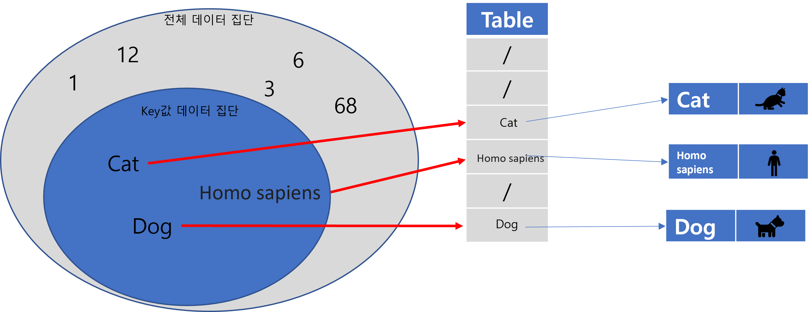
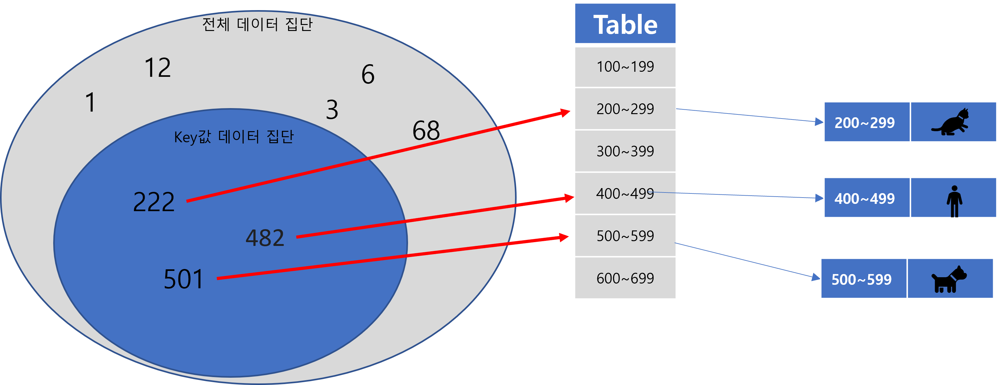
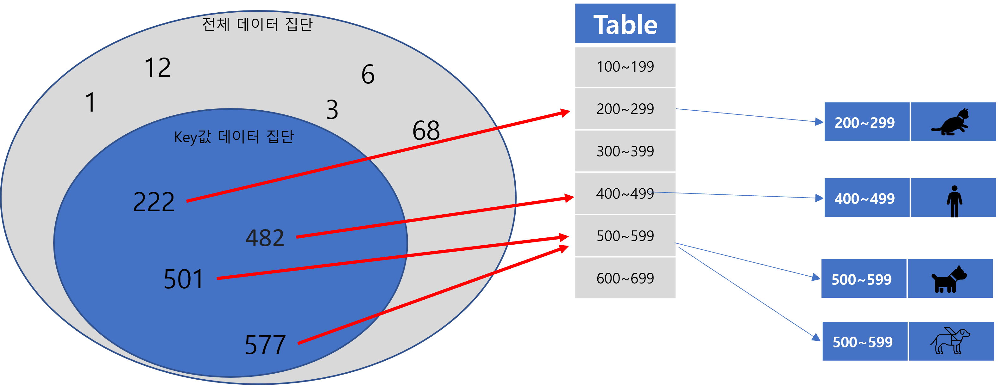

## Hash
안녕하세요 Jams & Donguk의 **Donguk**입니다

오늘은 데이터 타입 중 **<strong style="color: #bb4177;">'Hash'</strong>** 타입을 활용한 HashTable을 분석하겠습니다.

본 포스팅은 **Java**를 기준으로 설명할 것이므로 자바와 관련된 객체들이 등장할 수 있습니다. 하지만 근간은 **Hash**가 어떤 것이고 어디에 사용되는지를 알려드리기 위함이니 본인이 사용하시는 언어와 상이한 내용은 찾아보시면서 맞춰 보시면 될 것 같습니다.
<br/><br/>

### HashTable(HashMap)이란?
Hash는 데이터를 빠르게 조회하기 위해 사용되는 데이터 타입으로 원하는 데이터를 찾을 수 있는 **<strong style="color: #bb4177;">'Key값'</strong>**과 해당하는 Key값에 대한 **<strong style="color: #bb4177;">'Value값'</strong>**으로 구성된 데이터 타입입니다.
또한 이렇게 지정된 **Key값은 LinkedList 형태로 Chaining**이 됩니다.
때문에 저장 및 데이터를 조회하는 평균적인 시간 복잡도가 충돌이 발생하지 않는다는 전제하에 거의 **O(1)**에 수렴하는 데이터 타입입니다.

보통 Hash에 대해 찾아보면 위와 같은 설명이 있습니다

하지만 (https://hsp1116.tistory.com/35) 블로그를 통해 Hash에 대한 접근을 하기 전 Table에는 어떤 종류가 존재하는지 이해하시면 훨씬 도움이 될 것 같아 간략하게 소개해 드리겠습니다.
<br/><br/>

### Table
Hash는 기본적으로 HashTable을 구성합니다.
이 HashTable을 이해하기 위해서는 선제적으로 **<strong style="color: #bb4177;">'Direct Addressing Table'</strong>**, **<strong style="color: #bb4177;">'Open Addressing Table'</strong>**을 알아야 합니다.<br/>
Open Addressing은 어려워서 이해하기 어렵더라도 Direct Addressing Table을 아셔야 합니다.<br/>
*가끔 Direct Addressing Table을 HashTable로 착각하시는 분들이 있습니다.*<br/><br/>

#### Direct Addressing Table
Direct Addressing Table은 아래 이름처럼 Table 내에 해당 Key값 자체가 고유한 값을 가지기 때문에 저장 및 조회 시 다른 영역을 조회할 필요가 없어 시간 복잡도가 무조건 **O(1)**에 수렴하는 Table입니다.
<br/><br/>

<br/><br/>
얼핏 보면 상당한 장점만 존재하는 것 같지만 이 테이블은 Key값 자체가 모두 테이블 내에서 **유니크한 값**을 가지기 때문에 Table 자체가 메모리 공간을 크게 차지하고 있어야 하는 이슈가 생기게 됩니다.<br/>
많은 양의 데이터를 저장할 때는 이슈가 없습니다만 적은 양의 데이터를 저장하면서 수시로 이 객체를 생성해 사용하게 되면 **메모리 낭비**는 심각해질 것입니다.<br/>
이런 이슈를 해결하고자 등장한 Table이 **<strong style="color: #bb4177;">'Hash Table'</strong>**입니다.
<br/><br/>

#### HashTable
HashTable은 아래 그림과 같이 Table 한 칸을 고유한 Key값 하나에 배정하지 않고 특정 영역 자체를 배정함으로써 해당 영역에 저장될 수 있는 Key값들을 저장해 줍니다.
<br/><br/>

<br/><br/>
이 때 저 Table **칸마다 어떤 값**들이 올 수 있는지 결정하는 함수를 **<strong style="color: #bb4177;">'Hash Function'</strong>**이라고 부르며 이 Hash Function의 성능에 따라 HashTable의 성능이 결정됩니다.
<br/><br/>
HashFunction 성능을 결정하는 요소는 크게 2가지입니다.<br/>
*1) 얼마나 충돌이 적게 발생하는가?<br/>(시간 복잡도 감소)*
<br/>
*2) 메모리 공간을 얼마나 효율적으로 관리하는가?<br/>(공간 복잡도 감소)*
<br/><br/>
그럼 여기서 충돌이란 무엇일까요? 위 사진에서는 각각의 Key값들이 모두 개별적인 Table 영역으로 이동하고 있기 때문에 아무런 충돌이 발생하지 않습니다. 하지만 아래와 같은 상황이라면 어떨까요?
<br/><br/>

<br/><br/>
하나의 Table 영역으로 2개의 Key값이 몰리면서 충돌이 나게 됩니다.<br/>
즉, 해당 칸에 *이미 2개의 결괏값이 존재*하므로 각각의 **Key에 대한 Value값은 어떤 것이 반환되어야 하는지 알 수 없는 상태**가 됩니다.
<br/><br/>
이것을 **<strong style="color: #bb4177;">'충돌'</strong>**이라고 부르며 이를 해결하기 위해 위에 말했던 **<strong style="color: #bb4177;">'LinkedList'</strong>**가 등장합니다.
<br/><br/>
LinkedList는 배열 형태로서 인덱스를 가지는 것이 아니라 **첫 번째 값이 두 번째 값의 주소를 가지는 형태**의 List를 의미합니다.
HashTable에서는 이 충돌을 막고자 Table의 각 칸을 LinkedList로 만들어 각 배열값마다 **<strong style="color: #bb4177;">내부적으로 Key와 Value를 가지게 함</strong>**으로서 이 충돌을 예방합니다.
아래 그림을 보시면 위 그림과 다르게 각각이 고유한 키값을 가지면서도 하나의 칸에 존재할 수 있는 것을 알 수 있습니다.
<br/><br/>

<br/><br/>
이렇게 충돌이 나는 것들을 LinkedList로 이어주는 것을 **<strong style="color: #bb4177;">'Chaining'</strong>**이라고 부릅니다.
<br/><br/>

## 마무리 및 지식 공유
사용할 때는 아무 고민 없이 사용하던 이 Hash를 분석하다 보니 다양한 사실들을 알 수 있는 시간이었습니다.
<br/>
덤으로 지식 몇 가지를 공유하자면 Java를 사용하시는 분들은 흔히 *HashTable*이나 *HashMap*을 사용하고 있으실 겁니다.
<br/>
위 둘은 **<strong style="color: #bb4177;">'동기화(synchronized)'</strong>**를 지원하냐 지원하지 않냐의 차이인데 Web개발자인 저로서는 기본적으로 **Multi-Thread 환경**을 고려해야 하기 때문에 **동기화를 지원하지 않는 HashMap**을 사용하기에는 부담이 있었습니다.
<br/>
하지만 HashTable을 사용하기에는 기본적으로 **하나의 작업을 할 때 모든 작업이 중단**되는 현상이 있다 보니 **성능 저하가 크다**는 단점 때문에 선택하기 어려웠습니다.
<br/><br/>
이 때문에 새로운 객체를 찾다보니 **<strong style="color: #bb4177;">'ConcurrentHashMap'</strong>**을 찾을 수 있었고 이 객체는 동기화를 지원하면서도 **HashTable보다 성능이 개선된 객체**여서 여러분도 추후 HashTable 활용이 필요할 시 해당 객체를 고려해 보시면 좋을 것 같습니다.
<br/><br/>
아래는 해당 객체가 HashTable보다 왜 성능이 좋은지 정리한 내용입니다.
긴 글 읽어 주셔서 감사합니다.
<br/><br/>

### HashTable 방식
메서드에 모두 synchronized를 걸기 때문에 동시에 모두 락이 걸림
```java
class SharedData {
    private int intData;
    private boolean boolData;

    public synchronized int getInt() { return intData; }
    public synchronized void setInt(int n) { intData = n; }
    public synchronized boolean getBool() { return boolData; }
    public synchronized void setBool(boolean b) { boolData = b; }
};
```
<br/>

### ConcurrentHashMap 방식
개별 메서드가 실행될 때 메서드별로 Synchronized를 걸기 때문에
전체가 동시에 멈출 이유가 없음
```java
class SharedData {
    private int intData;
    private boolean boolData;
    private Object intSync = new Object();
    private Object boolSync = new Object();

    public int getInt() { synchronized (intSync) { return intData; } }
    public void setInt(int n) { synchronized (intSync) { intData = n; } }
    public boolean getBool() { synchornized (boolSync) { return boolData; } }
    public void setBool(boolean b) { synchronized (boolSync) { boolData = b; } }
}
```
