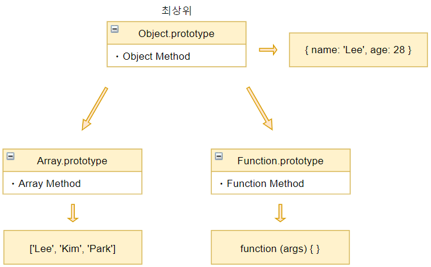

자바스크립트는 **명령형, 함수형, 프로토타입 기반 객체지향 프로그래밍**을 지원하는 <strong style="color: #bb4177;">멀티 패러다임 프로그래밍 언어</strong>이다.

자바스크립트를 공부하다 보면 **프로토타입 (Prototype)**이라는 개념에 맞닥뜨리게 된다.<br />
처음 자바스크립트를 공부할 때 Prototype 개념은 나에게 조금 어려웠다. 이것의 용도와 사용법을 알지 못해 방황했었다.

Prototype 간단한 기능을 구현을 위해 크게 쓰일 필요가 없고 생각보다 개념이 어려워 모르고 넘어가거나 미뤄두는 경우가 많다. <span style="text-decoration-line: line-through;">(내가 그랬었다..)</span><br />

지금도 완벽하게 이해했다고 생각하지 않지만 지금까지 공부한 것을 어려운? 부분을 제외한 개념만 최대한 쉽게 설명해볼 생각이다.

## Prototype
>자바스크립트의 모든 객체는 자신을 생성한 객체 원형에 대한 숨겨진 연결을 갖는다. 이때 **자기 자신을 생성하기 위해 사용된 객체원형을 프로토타입이**란 한다. 

프로토타입, 나는 개인적으로 프로토타입은 상속이라고 생각하니 쉽게 이해가 됐다.<br />
배열을 예로 들어보자. (자바스크립트에서 배열은 객체이다) 배열을 선언하면 **map, reduce, forEach, push...** 등 배열에 관련된 다양한 함수를 사용할 수 있다.
```javascript
const arr = ['Lee', 'Kim', 'Park'];

const newArr = arr.map(n => n + '1'); // ['Lee1', 'Kim1', 'Park1']
const newArr2 = arr.concat('Cho'); // ['Lee', 'Kim', 'Park', 'Cho']
```
그저 배열을 선언했을 뿐인데 어떻게 저런 메소드를 사용할 수 있을까?<br />
밑의 사진을 보며 쉽게 이해해 보자.
<p>
  <center>
    
  </center>
</p>

배열이 선언되면 **arr**이라는 배열이 생성되면서 부모?를 자동으로 할당해 준다. 즉, 어떠한 객체가 만들어지기 위해 그 객체의 모태가 되는 녀석을 **프로토타입**이라고 한다.<br />
위에 사진을 보다시피 배열을 선언하니 자동으로 선언된 배열에 Array.prototype를 부모?로 자동 할당해줬다.

이제 콘솔을 찍어 아까 생성한 배열을 살펴보자.
```javascript
console.dir(arr);
```
<p>
  <center>
    
  </center>
</p>
console.dir로 arr을 찍어보면 밑에 **[[Prototype]]**으로 연결된 자신의 프로토타입을 확인할 수 있다. 이 프로토타입을 확인해보면
우리가 사용하는 Array 배열에 관한 다양한 메소드가 정의된 것을 확인할 수 있다.

그러면 이 프로토타입을 왜 사용하는걸까?<br />
내용이 길어지면 보기 힘들고 이해하기 힘들거라 생각해 추후 업로드 할 글에서 확인해보자.

To Be Continue....

## 마무리
프로토타입을 공부하면서 이해한 내용을 가볍게 정리해봤습니다. 피드백은 환영입니다.
