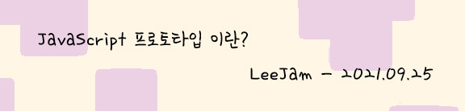
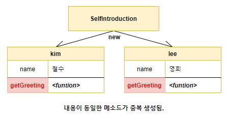
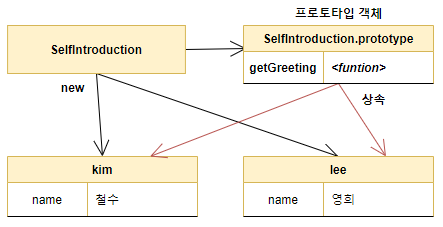

이전 글에서 프로트타입이란 무엇인가에 대해 가볍게 정리해봤다.

>
<center>
  <a href="https://leejams.github.io/Prototype/" >
    
  </a>
</center>
>

이번 글에서는 프로토타입을 **왜? 그리고 어떻게? 사용하는지** 쉽고 가볍게 정리해볼 생각이다.
### Prototype 사용법과 사용이유
>**자바스크립트는 프로토타입을 기반으로 상속을 구현하여 <strong style="color: #bb4177;">불필요한 중복을 제거한다.</strong>**

먼저 예시를 보겠습니다..
```javascript
function SelfIntroduction(name) {
  this.name = name;
  this.getGreeting = function() {
    return `안녕하세요 제 이름은 ${this.name}입니다. 반갑습니다.`
  }
}

const kim = new SelfIntroduction("철수");
const lee = new SelfIntroduction("영희");

/* 
  SelfIntroduction 함수는 인스턴스를 생성할 때마다 동일한 동작을 하는 
  getGreeting 메소드를 중복 생성하고 모든 인스턴스가 중복 수유한다. 
*/

console.log(kim.getGreeting === lee.getGreeting); // false

// 안녕하세요 제 이름은 철수입니다. 반갑습니다.
console.log(kim.getGreeting());

// 안녕하세요 제 이름은 영희입니다. 반갑습니다.
console.log(lee.getGreeting()); 
```
**SelfIntroduction** 함수를 통해 동일한 구조를 갖는 객체를 여러 개 생성할 수 있다. 하지만 위의 예시에는 문제가 있다. 

**무엇이 문제일까?**

**name** 프로퍼티 값은 일반적으로 인스턴스마다 다르다. 하지만 **getGreeting**은 모든 인스턴스가 동일한 내용의 메소드를 사용한다. <br />
하지만 현재 예시에서 **getGreeting** 메소드는 모든 인스턴스가 <strong style="color: #bb4177;">중복 소유하고 있다.</strong>
<p>
  <center>
    
  </center>
</p>
객체가 많아지면 중복되는 데이터가 많이지고, 그렇게 되면 메모리 낭비가 발생합니다. 

**Prototype을 통해 위의 문제를 해결할 수 있다.**

```javascript
function SelfIntroduction(name) {
  this.name = name;
}

// getGreeting을 공유해서 사용할 수 있게 프로토타입에 추가한다.
SelfIntroduction.prototype.getGreeting = function () {
  return `안녕하세요 제 이름은 ${this.name}입니다. 반갑습니다.`
}

const kim = new SelfIntroduction("철수");
const lee = new SelfIntroduction("영희");

// 모든 인스턴스는 하나의 getGreeting 메소드를 공유한다.
console.log(kim.getGreeting === lee.getGreeting); // true

// 안녕하세요 제 이름은 철수입니다. 반갑습니다.
console.log(kim.getGreeting());

// 안녕하세요 제 이름은 영희입니다. 반갑습니다.
console.log(lee.getGreeting()); 
```
위 코드를 이미지로 살펴보자.
<p>
  <center>
    
  </center>
</p>

SelfIntroduction 함수가 생성한 **모든 인스턴스는 자신의 프로토타입을 상속받는다.**

이렇게 공통으로 사용할 프로퍼티나 메소드를 프로토타입에 미리 구현해 두면 처음 예시처럼 객체가 많아져도 <strong style="color: #bb4177;">메모리의 낭비가 발생하지 않고 코드의 재사용이라는 관점에서 매우 유용하게 사용할 수 있다.</strong>

## 마무리
오늘은 이렇게 프로토타입의 사용법과 사용이유에 관련된 내용을 가볍게 정리해봤습니다. 피드백은 언제나 환영입니다.