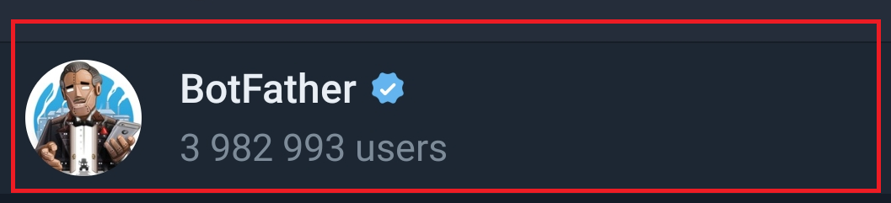
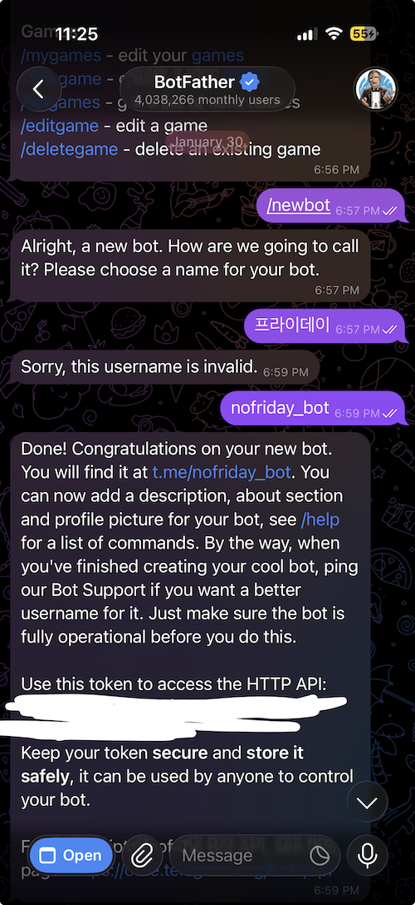
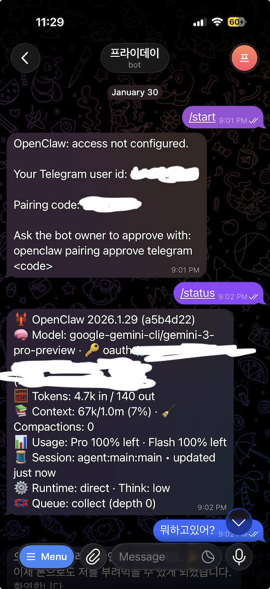

## 도입

요즘 하루가 멀다 하고 openclaw 얘기가 타임라인에 올라오는데, 이렇게 핫한 기술을 안 써볼 수는 없었다.  
마침 집에 굴러다니는 M1 맥미니 한 대가 있어서, "이거야말로 개인 AI 비서 서버로 쓰면 딱이겠다"는 생각이 들었다.  
문제는, 막상 "AI 에이전트"를 띄워 놓고 뭘 시킬지가 애매했다는 점이다. X(트위터)도 제대로 해본 적이 거의 없어서, 차라리 이 기회에 SNS 활동 자체를 openclaw에 한 번 위임해보자는 쪽으로 방향을 잡았다.

---

## 목차

1. [openclaw 설치 전에 고민한 것들](#openclaw-설치-전에-고민한-것들)
2. [openclaw 설치 및 세팅](#openclaw-설치-및-세팅)
   - [온보딩 과정과 주의사항](#온보딩-과정과-주의사항)
3. [기본 LLM: Google Gemini로 시작하기](#기본-llm-google-gemini로-시작하기)
4. [텔레그램 연동으로 대화 채널 열기](#텔레그램-연동으로-대화-채널-열기)
5. [X(트위터) 권한을 왜, 어떻게 위임할까?](#xtwitter-권한을-왜-어떻게-위임할까)
   - [브라우저 제어를 통한 X 권한 위임](#브라우저-제어를-통한-x-권한-위임)
   - [Chrome Extension 설치 및 설정](#chrome-extension-설치-및-설정)
   - [실제 사용 흐름](#실제-사용-흐름)
   - [보안 고려사항](#보안-고려사항)

---

## openclaw 설치 전에 고민한 것들

openclaw는 기본적으로 로컬에서 돌아가는 에이전트 플랫폼이라, 내 키와 데이터가 전부 집 안 맥에서만 돌아간다는 점이 마음에 들었다.
대신 그 말은 곧, 이 맥이 털리면 내 API 키나 계정 권한이 한 번에 털릴 수도 있다는 뜻이기도 해서, 메인 개발 머신 대신 남는 컴퓨터(맥미니)를 전용 서버처럼 사용하기로 했다.

개발용 노트북에 이것저것 깔려 있는 상태라면, 아예 별도 계정/별도 머신에만 openclaw를 설치하는 것을 추천합니다. 어차피 24시간 켜둘 서버 역할이라, 남는 맥/미니 PC 하나 두고 사용하는 것이 보안·안정성 면에서 낫습니다.

---

## openclaw 설치 및 세팅

설치는 크게 어렵지 않다. 맥에서 터미널을 열고, Node 22+와 npm이 준비돼 있다는 전제하에 전역 설치로 설치할 수 있다. [openclaw 설치 가이드](https://docs.openclaw.ai/install/index)

```bash
# openclaw 전역 설치 (둘 중 하나 택1)
npm install -g openclaw@latest
# 또는
pnpm add -g openclaw@latest
```

설치가 끝나면 핵심은 이 한 줄이다.

```bash
openclaw onboard --install-daemon
```

### 온보딩 과정과 주의사항

`openclaw onboard` 명령을 실행하면 인터랙티브한 온보딩 마법사가 시작된다. 이 과정에서 몇 가지 중요한 설정을 해야 하는데, 처음 사용하는 경우 주의해야 할 점들이 있다.

**보안 경고**

openclaw는 강력한 AI 에이전트 플랫폼이지만, 동시에 위험할 수 있다. 에이전트가 시스템 명령을 실행하거나, 브라우저를 제어하거나, 파일 시스템에 접근할 수 있기 때문이다. 따라서 신뢰할 수 있는 환경에서만 사용하고, 처음에는 제한적인 권한으로 시작하는 것이 좋다.

**온보딩 모드 선택**

마법사는 먼저 **QuickStart** 또는 **Advanced** 모드를 선택하라고 한다. 처음 사용하는 경우 QuickStart를 추천한다. QuickStart는 기본값을 사용하므로 설정이 간단하다:

- Local gateway (loopback)
- Gateway 포트 18789
- Gateway 인증 토큰 (자동 생성)
- Tailscale 노출 Off

Advanced 모드는 모든 단계를 직접 설정할 수 있지만, 처음에는 QuickStart로 시작하는 것이 좋다.

**온보딩 과정에서 설정하는 것들 (Local 모드 기준)**

1. **기존 설정 확인**: `~/.openclaw/openclaw.json`이 이미 존재하면 유지/수정/리셋 중 선택한다.

2. **모델 및 인증 설정**: 사용할 LLM 모델을 선택하고 인증을 설정한다.

   - **Anthropic (Claude)**: API 키 또는 OAuth 인증
   - **OpenAI**: API 키 또는 Codex CLI OAuth
   - **Google Gemini**: API 키 또는 Gemini CLI (CLI에 이미 로그인되어 있으면 자격증명만 설정)
   - **기타**: MiniMax, Moonshot, Vercel AI Gateway, OpenCode Zen 등

   Google Gemini를 선택하는 경우, Gemini CLI에 이미 로그인되어 있으면 자격증명만 설정하면 되어서 쉽게 연동할 수 있다. 모델은 Gemini 2.5 Flash를 추천한다. Pro도 있지만 Flash가 더 낫다고 느꼈다. Flash 모델은 어느 정도 무료 티어 안에서 꽤 넉넉하게 돌릴 수 있어서, "실험용 개인 에이전트"에는 최적이다.

3. **Workspace 설정**: 에이전트가 사용할 워크스페이스 위치를 설정한다. 기본값은 `~/.openclaw/workspace`이다.

4. **Gateway 설정**: 포트, 바인드 주소, 인증 모드, Tailscale 노출 여부를 설정한다. Local 모드에서는 기본값(포트 18789, loopback)을 사용하는 것이 좋다.

5. **채널 설정**: 텔레그램, WhatsApp, Discord 등 사용할 채널을 선택하고 설정한다. 처음에는 하나만 설정해도 된다.

6. **Daemon 설치**: 백그라운드에서 실행되도록 데몬을 설치한다. macOS는 LaunchAgent, Linux는 systemd user unit을 사용한다.

7. **Health check**: Gateway가 정상적으로 실행되는지 확인한다.

8. **Skills (선택사항)**: 추가 기능을 위한 스킬을 설치할 수 있다. 처음에는 건너뛰어도 된다.

**Remote 모드**

Remote 모드를 선택하면 로컬 클라이언트만 설정하고, 원격 Gateway에 연결하도록 구성한다. 원격 Gateway 자체는 설정하지 않는다.

온보딩 과정에서 모델/채널/기본 옵션을 물어보는데, 처음에는 너무 욕심내지 말고 "일단 돌아가게" 만드는 데 집중하는 것이 좋습니다.  
M1 맥에서 설치를 마치고 나면 보통 홈 디렉터리 아래 `~/.openclaw/` 쪽에 설정과 상태, 워크스페이스, 자격 증명들이 정리돼 들어간다.

---

## 기본 LLM: Google Gemini로 시작하기

온보딩 과정에서 Google Gemini를 모델로 선택했다면, 설정이 완료되면 바로 사용할 수 있다.

설정이 완료되면 게이트웨이를 실행하면 로컬 브라우저에서도 대화할 수 있다. 게이트웨이를 실행하면 보통 `http://127.0.0.1:18789/` 주소로 웹 인터페이스에 접근할 수 있어서, 텔레그램뿐만 아니라 브라우저에서도 직접 AI와 대화할 수 있다.

---

## 텔레그램 연동으로 대화 채널 열기

X(트위터) 위임을 하기 전에, 우선은 내가 편하게 컨트롤할 수 있는 대화 채널이 필요했다.  
그중에서 텔레그램이 가장 세팅이 단순해서, 첫 번째 채널로 텔레그램을 선택했다. [getopenclaw](https://www.getopenclaw.ai/integrations/telegram)

대략 순서는 다음과 같다.

1. 텔레그램에서 BotFather로 봇 생성

   텔레그램에서 BotFather를 검색하여 시작한다.

   

   - `/newbot` 명령으로 봇 이름, 사용자 이름 생성
   - 봇 토큰(bot token) 복사

   

2. 내 텔레그램 계정의 user ID 확인

   - `@userinfobot` 같은 유저 정보 봇을 추가해서, 본인 user ID 확인
   - 이 값이 있어야 openclaw 쪽에서 "누구 메시지를 받아줄지"를 제한할 수 있다. [youtube](https://www.youtube.com/watch?v=g7xE5RTxi6g)

3. openclaw 설정에 텔레그램 섹션 추가  
   예를 들어 `~/.openclaw/config.yaml` 또는 해당되는 설정 파일에 다음과 비슷한 내용을 추가한다. [getopenclaw](https://www.getopenclaw.ai/integrations/telegram)

   ```yaml
   telegram:
     botToken: "123456789:ABCdefGHIjklMNOpqrSTUvwxYZ"
     allowedUsers:
       - 987654321 # 내 텔레그램 user ID
   ```

4. 게이트웨이(or 서버) 실행

   ```bash
   openclaw gateway start
   ```

   이 상태에서 텔레그램 앱에서 내 봇에게 말을 걸면, openclaw가 메시지를 받아서 Gemini에 넘기고, 응답을 다시 텔레그램으로 보내준다.

   `/status` 명령으로 현재 상태를 확인할 수 있다.

   

이렇게 텔레그램이 열리고 나면, 사실상 "내 손에 든 텔레그램 = 맥미니 안에서 돌아가는 openclaw 콘솔"이 됩니다.  
이제 여기에서 명령을 내리든, 일상을 물어보든, 나중에는 X 포스팅 아이디어를 던져서 트윗까지 부탁하든, 전부 같은 채널에서 처리할 수 있습니다.

---

## X(트위터) 권한을 왜, 어떻게 위임할까?

나는 SNS를 거의 안 하다시피 해서, X에 뭔가를 꾸준히 올리는 습관이 전혀 없었다.  
그래도 개발자 포지션이다 보니, openclaw 같은 에이전트 플랫폼을 사용하려면 "어디에 뭘 시킬지"가 항상 고민인데, 그중 가장 실험하기 좋은 대상이 X였다. 어차피 방치 계정이기도 했고, 실험용으로 사용하기에도 부담이 덜했다.

그래서 방향을 이렇게 잡았다.

- 맥미니에 openclaw + Gemini 환경을 꾸려놓고,
- 텔레그램으로 AI와 대화하면서 포스팅 아이디어를 주고받고,
- X API 권한을 openclaw 쪽에 위임해서, 실제 포스팅/리플 정도는 자동으로 처리해 보자.

### 브라우저 제어를 통한 X 권한 위임

openclaw에서 X(트위터) 같은 웹 서비스를 제어하는 방법은 크게 두 가지가 있다. 하나는 공식 API를 사용하는 것이고, 다른 하나는 **Chrome Extension을 통한 브라우저 제어**다. [Chrome Extension 문서](https://docs.openclaw.ai/tools/chrome-extension)

공식 API는 보통 개발자 계정 신청, API 키 발급, 권한 범위 설정 같은 복잡한 절차가 필요하다. 반면 브라우저 제어 방식은 내가 이미 로그인해 둔 Chrome 탭을 openclaw가 직접 조작하는 방식이라, API 키 발급 없이도 "내가 브라우저에서 하는 행동"을 그대로 자동화할 수 있다.

openclaw의 Chrome Extension은 내 **기존 Chrome 탭**을 제어하는 방식으로 동작한다. 별도의 openclaw 전용 브라우저 프로필을 띄우는 것이 아니라, 내가 평소 사용하던 Chrome 창의 특정 탭을 openclaw에 "위임"하는 개념이다.

### Chrome Extension 설치 및 설정

설치 과정은 간단하다. [Chrome Extension 문서](https://docs.openclaw.ai/tools/chrome-extension)

```bash
# Extension을 안정적인 로컬 경로에 설치
openclaw browser extension install

# 설치된 Extension 디렉터리 경로 확인
openclaw browser extension path
```

설치가 끝나면 Chrome에서 `chrome://extensions`로 들어가서:

1. "개발자 모드" 활성화
2. "압축해제된 확장 프로그램을 로드합니다" 클릭
3. 위에서 확인한 Extension 디렉터리 선택
4. Extension을 툴바에 고정

openclaw는 기본적으로 `chrome`이라는 브라우저 프로필을 제공하는데, 이게 Extension relay를 기본 포트(`http://127.0.0.1:18792`)로 연결하도록 설정되어 있다. 별도 설정 없이 바로 사용할 수 있다.

### 실제 사용 흐름

1. **X(트위터)에 로그인**: 평소처럼 Chrome에서 X에 로그인해 둔다. 이때 **전용 Chrome 프로필**을 사용하는 것을 강력히 권장한다. 개인 브라우징 프로필에 위임하면, 에이전트가 내 모든 계정 상태에 접근할 수 있게 되기 때문이다.

2. **Extension으로 탭 위임**: X가 열린 탭에서 Extension 아이콘을 클릭한다. 배지가 `ON`으로 바뀌면 해당 탭이 openclaw의 제어 하에 들어간다. `…`는 연결 중, `!`는 relay 서버에 연결할 수 없다는 뜻이다.

3. **에이전트에게 명령**: 텔레그램이나 다른 채널을 통해 "X에 이 내용 포스팅해줘" 같은 명령을 내리면, openclaw가 브라우저를 제어해서 실제로 트윗을 작성하고 포스팅한다.

### 보안 고려사항

이 방식은 강력하지만 동시에 위험할 수 있다. Extension이 Chrome의 디버거 API(`chrome.debugger`)를 사용하기 때문에, 위임된 탭에서는 에이전트가 클릭, 타이핑, 네비게이션, 페이지 내용 읽기 등 거의 모든 행동을 할 수 있다. [Chrome Extension 문서](https://docs.openclaw.ai/tools/chrome-extension)

**권장 사항:**

- **전용 Chrome 프로필 사용**: 개인 브라우징과 완전히 분리된 프로필을 만들어서 X 전용으로만 사용한다.
- **Gateway와 Node 호스트는 Tailnet 내부로 제한**: 공용 네트워크에 relay 포트를 노출하지 않는다.
- **의도적인 노드 페어링**: 원격 제어가 필요 없다면 브라우저 프록시 라우팅을 비활성화한다.

저는 실험용 계정이라 부담이 덜했지만, 실제 개인 계정을 위임할 때는 이런 보안 고려사항을 꼭 염두에 두는 것이 좋습니다.

이 글에서는 우선 설치와 텔레그램까지의 기본 세팅, 그리고 X 권한 위임의 개념과 Chrome Extension 방식까지 다뤘습니다. 실제로 어떤 프롬프트를 사용하고, 어떤 워크플로우로 트윗을 자동화했는지는 다음 글에서 좀 더 구체적으로 풀어볼 생각입니다.

피드백은 언제나 환영입니다. 😊
