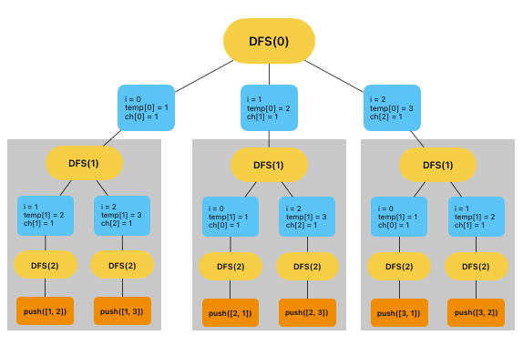

#### 후행학습
[[알고리즘] JavaScript 순열과 조합 알고리즘 구현하기 (조합 편)](https://leejams.github.io/%EC%A1%B0%ED%95%A9/){:target="\_blank"}

#### 순열이란?

> **서로 다른 n개의 원소에서 r개를 중복없이 순서에 상관있게 선택하는 혹은 나열하는 것을 순열(permutation)이라고 한다.**

여기서 **순서에 상관있게**이라는 단어가 중요하다. (이것이 조합과의 가장 큰 차이이다.)

"예를 들어 서로 다른 **3개의 숫자(1, 2, 3) 중 2개를 골라 가장 큰 수**를 구하시오." 라는 문제가 있다.<br/>
이 경우 **(12) (13) (21) (23) (31) (32)** 이렇게 **6가지 경우**의 숫자가 나올 수 있고 32가 가장 큰 수로 답은 32가 된다.

이 것이 가장 기초적인 순열을 구하는 방법이다. 거창한 설명이 붙었지만 순열은 초등학교 때부터 알게 모르게 써왔던 수학 개념 중 하나다.

순열의 경우의 수를 구하는 공식은 **nPr = n! / (n - r)!**로 위 문제의 경우 **3P2 = 3 * 2 * 1 / 1 = 6**으로 6가지의 경우의 수를 가지게 된다.

그럼 이제 자바스크립트 코드로 구현해보자.

#### 코드구현

**구현할 코드의 최종 이미지**


```javascript
function permutations(n, arr) {
  const answer = [];

  // n개의 인덱스를 가진 배열을 확보한다.
  // [empty, empty];
  const temp = Array(n);

  // 인덱스가 사용중인지 check하기 위한 배열을 선언한다. 
  // 0은 사용안함 / 1은 사용중
  const ch = Array.from({ length: n }, () => 0);

  // L: 현재 뎁스 레벨
  function DFS(L) {
    if (L === n) {

      // 매개변수 L이 n과 같아지면 answer에 push해준다.
      // slice() 메서드를 사용한 이유는 재귀를 돌며 temp가 바뀌기 떄문이다.
      answer.push(temp.slice());
    } else {
      for (let i = 0; i < arr.length; i++) {

        // ch[i]가 0이라면
        if (ch[i] === 0) {
          
          // ch[i]를 1로 바꾸어 현재 사용하고 있다고 설정한다.
          ch[i] = 1;

          // temp[L] 현재 레벨에 맞는 숫자를 넣어준다.
          temp[L] = arr[i];

          // 레벨을 1 올려준 뒤 DFS 재귀함수를 호출한다.
          // 레벨이 n과 같아지면 answer에 push후 종료할 것이고
          // 아닐 경우 현재 ch에 체크된 사용중 인덱스를 제외하고
          // for()문이 돌며 레벨이 맞춰질 때 까지 재귀함수를 실행할 것이다.
          DFS(L + 1);

          // 사용을 완료했으면 ch[1]에 다시 0을 넣어 사용하지 않음으로 설정한다.
          ch[i] = 0;
        }
      }
    }
  }

  // 레벨 0부터 실행한다.
  DFS(0);

  return answer;
}

console.log(permutations(2, [1, 2, 3]));
// [[1, 2], [1, 3], [2, 1], [2, 3], [3, 1], [3, 2]]
```


##### 정리

순열에 대해 알아봤습니다. 순열은 가끔 응용이 필요한 코딩테스트 문제에 등장하는데 잘 이해하셔서 도움이 됐으면 좋겠습니다.

피드백은 언제나 환영입니다. 😊
