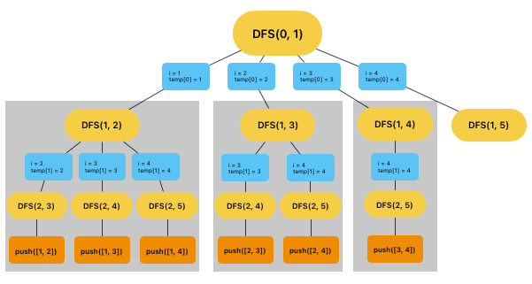

#### 선행학습
[[알고리즘] JavaScript 순열과 조합 알고리즘 구현하기 (순열 편)](https://leejams.github.io/%EC%88%9C%EC%97%B4/){:target="\_blank"}

#### 조합이란?

> **서로 다른 n개의 원소에서 r개를 중복없이 순서에 상관없게 선택하는 혹은 나열하는 것을 조합(combination)이라고 한다.**

여기서 **순서에 상관없게**이라는 단어가 중요하다. 즉, 선택의 순서와 상관없이 **같은 원소들이 선택되었다면 같은 조합**이며 다른 원소들이 선택되었다면 다른 조합이다.

"예를 들어 서로 다른 **4개의 숫자(1, 2, 3, 4) 중 2개를 선택할 수 있는 경우**를 구하시오." 라는 문제가 있다.<br/>
이 경우 순열과 다르게 같은 원소들이 선택되면 같은 조합이기 때문에 **(1, 2) (1, 3) (1, 4) (2, 3) (2, 4) (3, 4)** 이렇게 **6가지 경우**의 조합된 숫자가 나올 수 있다.

조합의 경우의 수를 구하는 공식은  **nCr = n! / (n - r)! * r!**로 위 문제의 경우 **4C2 = 4 * 3 * 2 / 2 * 2 = 6**으로 6가지의 경우의 수를 가지게 된다.

그럼 이제 자바스크립트 코드로 구현해보자.

#### 코드구현

**구현할 코드의 최종 이미지**


```javascript
function combinations(n, arr) {
  const answer = [];

  // n개의 인덱스를 가진 배열을 확보한다.
  // [empty, empty];
  const temp = Array(n);

  // L: 현재 뎁스 레벨 / s: for()문의 시작 번호
  function DFS(L, s) {

    // 매개변수 L이 n과 같아지면 answer에 push해준다.
    // slice() 메서드를 사용한 이유는 재귀를 돌며 temp가 바뀌기 떄문이다.
    if (L === n) answer.push(temp.slice());
    else {
      for (let i = s; i < arr.length; i++) {

        // temp[L] 현재 레벨 맞는 숫자를 넣어준다.
        temp[L] = arr[i];

        // 레벨 +1, for() 시작번호 +1을 하고 DFS 재귀함수를 호출한다.
        // 레벨이 n과 같아지면 answer에 push후 종료할 것이고
        // 아닐 for()문이 돌며 레벨이 맞춰질 때 까지 재귀함수를 실행할 것이다.
        DFS(L + 1, i + 1);
      }
    }
  }

  // 레벨 0, 시작 번호 0부터 시작하면 된다.
  DFS(0, 0);

  return answer;
}
console.log(combinations(2, [1, 2, 3, 4]));
// [[1, 2], [1, 3], [1, 4], [2, 3], [2, 4], [3, 4]]
```


##### 정리

조합에 대해 알아봤습니다. 순열을 알면 조합은 좀더 간편하게 구현할 수 있어 순열을 선행학습으로 잡았습니다. 조합도 가끔 응용이 필요한 코딩테스트 문제에 등장하는데 잘 이해하셔서 도움이 됐으면 좋겠습니다.

피드백은 언제나 환영입니다. 😊
