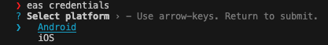
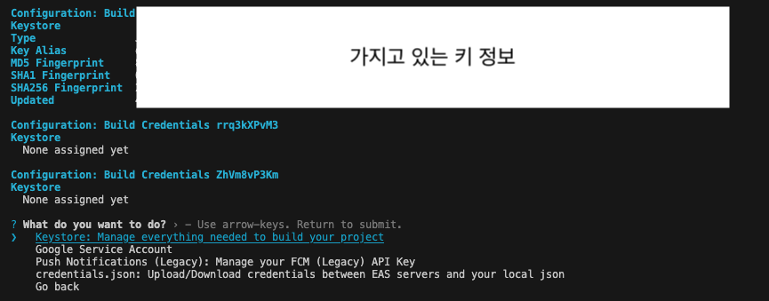

오랜만에 안드로이드 앱을 배포하려고 했는데, Expo로 빌드한 앱을 Google Play Console에 업로드하려고 했더니 다음과 같은 에러가 발생했습니다.

> Android App Bundle이 잘못된 키로 서명되었습니다. 제대로 된 서명 키로 App Bundle에 서명한 다음 다시 시도해 보세요.

이런 경우에는 Expo로 빌드한 앱을 Google Play Console에 업로드할 때 사용한 키스토어와 서명키가 일치하지 않는 경우인데 저는 기존 키스토어를 잃어버려서 새로운 키스토어를 생성해 해결했습니다.

우선 새로운 키스토어는 eas를 이용하시면 쉽게 생성할 수 있습니다. eas는 Expo Application Services로 Expo에서 제공하는 서비스입니다.

```bash
eas credentials
```

위 명령어를 실행하면 플렛폼을 선택하라는 메시지가 나오는데, 안드로이드를 선택합니다.



선택하게 되면 기존에 가지고 있던 키스토어를 확인할 수 있고, 새로운 키스토어를 생성할 수 있습니다.

**Keystore: Manage everything needed to build your project > Set up a new keystore**을 선택해 새로운 키스토어를 생성합니다.



키스토어를 생성하고 나면, 키를 다운로드 받을 수 있습니다.
**Download existing keystore**를 선택해 키를 다운로드 받습니다.

다운로드를 하게되면 키에 대한 정보를 터미널에 출력해주는데, 이 정보를 잘 기록해두셔야 합니다. **(Keystore password, Key alias, Key password)**

그리고 탐색기에 ~.jks 파일이 다운로드 되어있는 것을 확인할 수 있습니다.

이제 이 ~.jks 파일을 ~.pem 파일로 변환해야 합니다. 이 작업은 다음과 같이 진행합니다.
<br />
**keytool -export -rfc -keystore [.jks 파일 명] -alias [Key alias 명] -file [생성할업로드인증서이름].pem**
<br />
터미널에 위 명령어를 입력하면 Keystore password를 입력하라는 메시지가 나오는데, 입력하면 **생성할업로드인증서이름.pem** 파일이 생성됩니다.

이제 이 파일을 Google Play Console에서 설정 > 앱 서명 페이지로 가서 업로드 키 재설정 요청을 하면 됩니다.

요청 시 바로 처리되지 않고 영업일 기준 2일 정도 소요되는 것 같습니다.

이렇게 새로운 키스토어를 생성하고 Google Play Console에 업로드하면 Android App Bundle이 잘못된 키로 서명되었습니다. 에러를 해결할 수 있습니다.

피드백은 언제나 환영입니다. 😊
