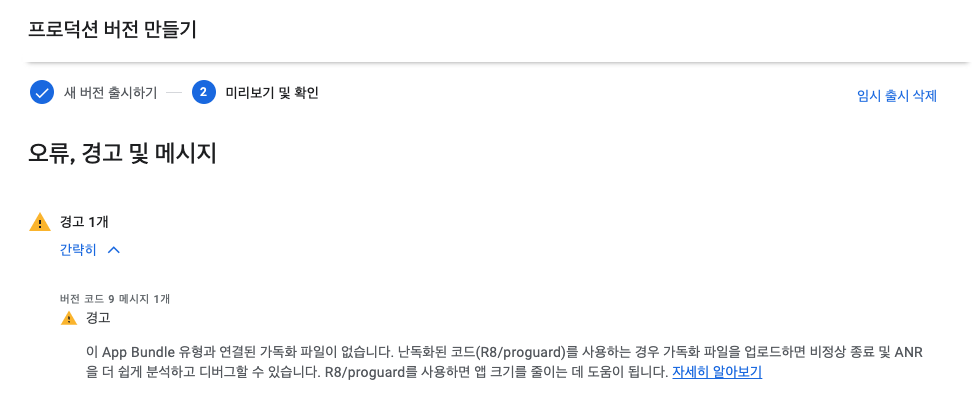

Android 앱을 배포할 때, Google Play Console에서 App Bundle을 사용하여 배포하면 다음과 같은 에러가 발생할 수 있습니다.



```
이 App Bundle 유형과 연결된 가독화 파일이 없습니다. 난독화된 코드(R8/proguard)를 사용하는 경우 가독화 파일을 업로드하면 비정상 종료 및 ANR을 더 쉽게 분석하고 디버그할 수 있습니다. R8/proguard를 사용하면 앱 크기를 줄이는 데 도움이 됩니다.
```

난독화된 코드란 앱의 소스 코드를 읽기 어렵게 만드는 기술을 의미하며, R8 및 Proguard가 대표적인 난독화 도구입니다. 이러한 난독화된 코드를 사용하는 경우 가독화 파일을 Google Play Console에 업로드해야 합니다.

Expo를 사용하는 경우 App Bundle을 사용하여 배포하게 되는데, 이 때 가독화 파일을 업로드하는 방법은 다음과 같습니다.

1. npx expo install expo-build-properties를 사용하여 expo-build-properties 패키지를 설치합니다.

```bash
npx expo install expo-build-properties
```

2. app.json 또는 app.config.js 파일에 다음과 같이 설정을 추가합니다.

```json
// app.json 사용 예
{
  "expo": {
    "plugins": [
      [
        "expo-build-properties",
        {
          "android": {
            "compileSdkVersion": 31,
            "targetSdkVersion": 31,
            "buildToolsVersion": "31.0.0"
          },
          "ios": {
            "deploymentTarget": "13.0"
          }
        }
      ]
    ]
  }
}
```

```javascript
// app.config.js 사용 예
export default {
  expo: {
    plugins: [
      [
        "expo-build-properties",
        {
          android: {
            compileSdkVersion: 31,
            targetSdkVersion: 31,
            buildToolsVersion: "31.0.0",
          },
          ios: {
            deploymentTarget: "13.0",
          },
        },
      ],
    ],
  },
};
```

3. 새로운 버전으로 빌드 수행
4. 생성된 App Bundle을 Google Play Console에 업로드합니다.

이제 App Bundle을 업로드하면 위에서 언급한 에러가 발생하지 않을 것입니다.

피드백은 언제나 환영입니다. 😊
