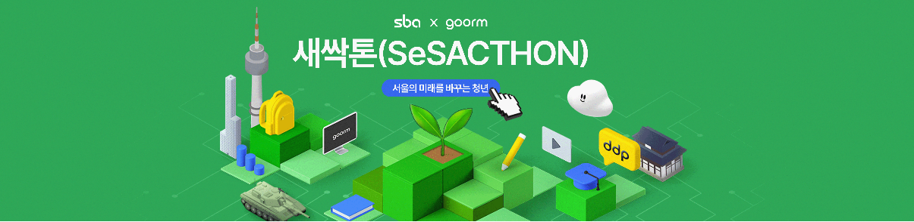
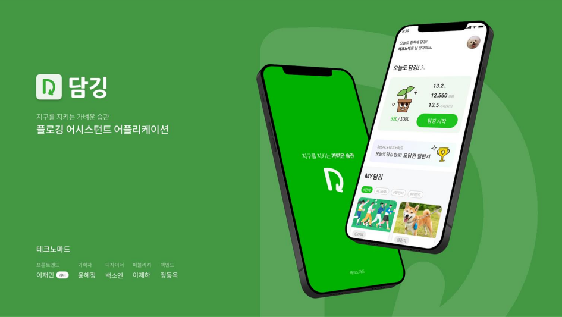
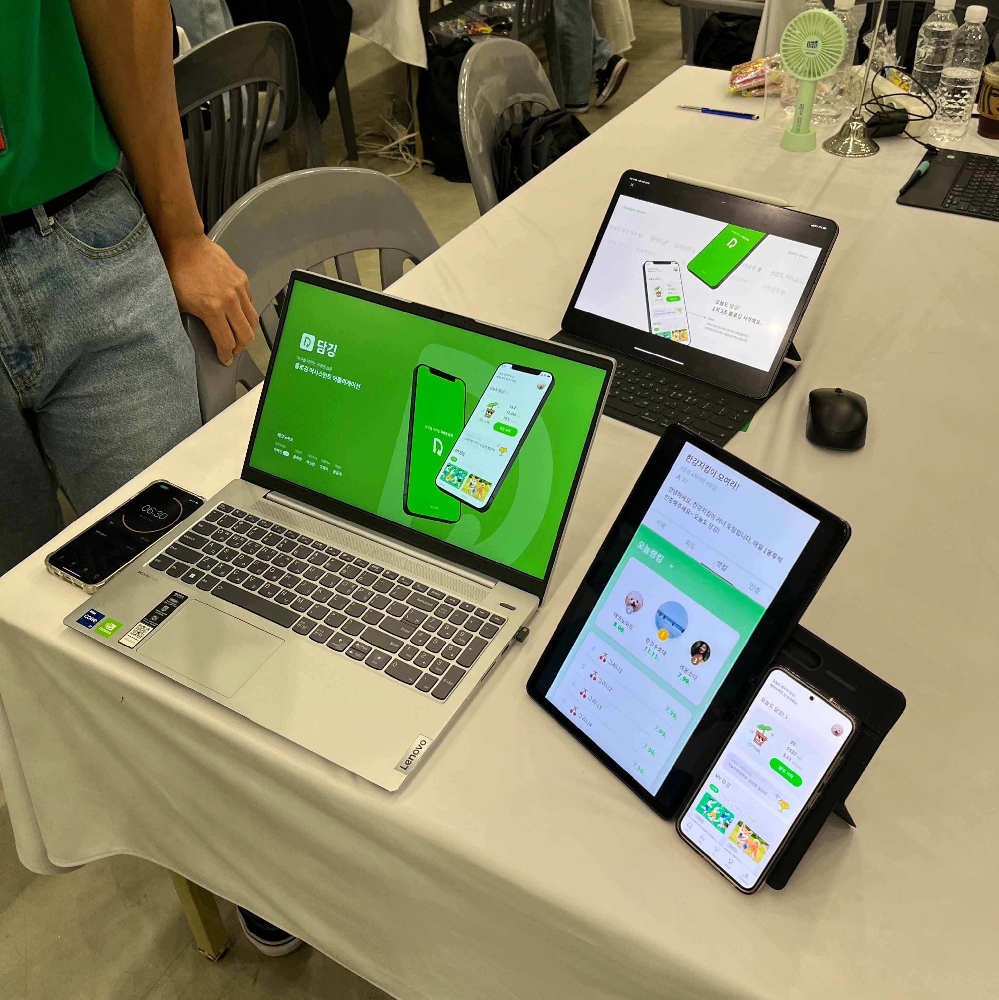
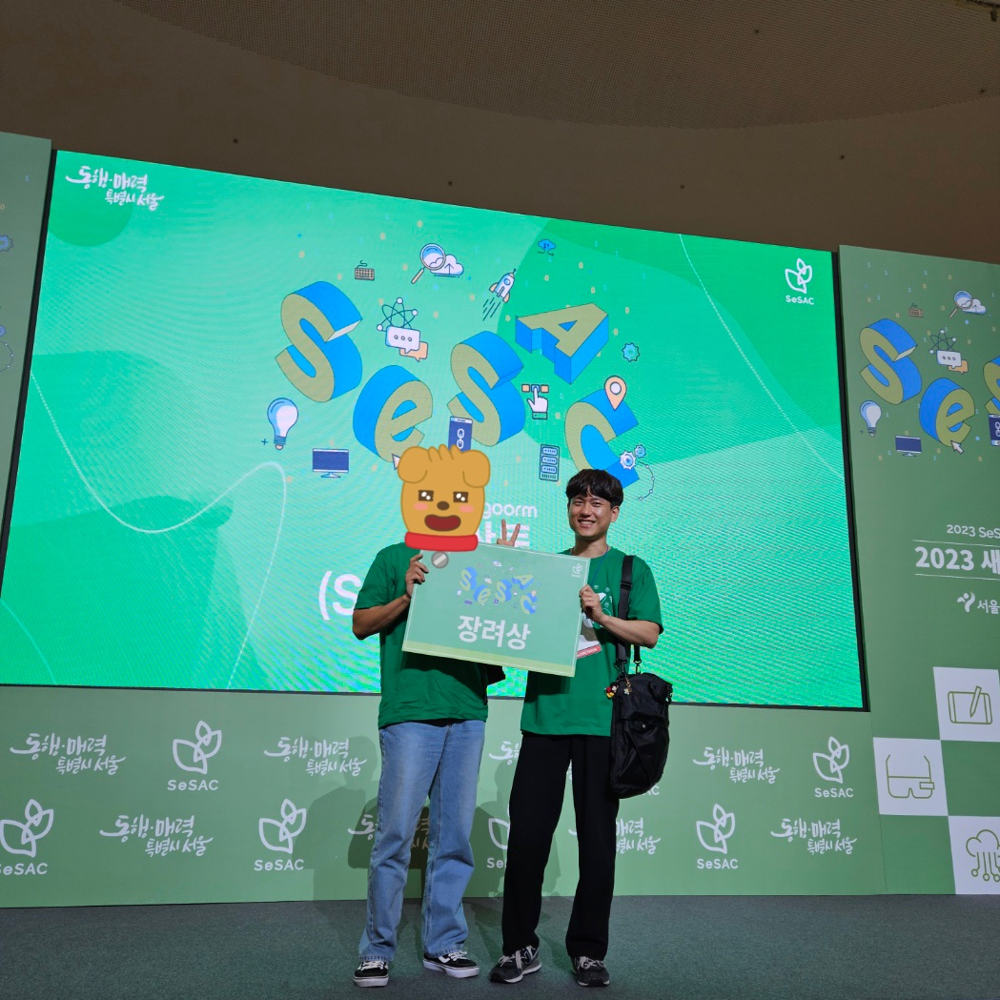
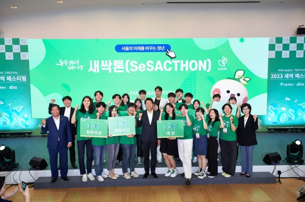

### 요약

이번에 goorm x SeSAC x 서울경제진흥원 주관한 해커톤인 새싹톤에 리더 및 프론트엔드 개발자로 참가하여 팀원들과 함께 도시환경 및 건강증진 주제의 플로깅 어시스턴트 앱 "담깅"을 개발하며 해커톤에서 **서울경제진흥원 상을 수상하고 개발자로서의 버킷리스트를 달성**할 수 있었던 의미있는 시간을 보냈습니다.

|팀명| 테크노마드|
|포지션| 프런트엔드, 팀장|
|서비스 | 담깅 (플로깅 어시스턴트 앱)|
|주요기능| 플로깅 중 실시간 동선, 걸음 수, 이동 거리 파악, 팀 모집 및 챌린지|
|주제| 도시환경 및 건강증진|
|수상| 서울경제진흥원장상(장려)|

[서울의 미래를 바꾸는 청년, 새싹톤이 열립니다.](https://sesacthon-apply.goorm.io/?utm_source=allforyoung&utm_medium=affiliate&utm_campaign=sasacthon){:target="\_blank"}

### 대회 전

**[서류통과 - 1차 과제 - 2차 과제 - 예선 - 본선]**

한 달이라는 짧은 기간동안 기획, 디자인, 개발 과제를 완성도 있게 수행하기 위해서 우리만의 전략이 필요했습니다.

**1. 목표 얼라이먼트**

**모든 팀원이 해커톤에서 추구하는 목표와 방향성을 일치시키는 것이 핵심이라 생각했습니다.** 우리 팀이 해결하고자 하는 문제와 서비스에 대해 명확한 비전을 공유하고 의견 충돌이 있을 수 있는 부분에 대해 개방적인 토론을 통해 상호 간에 존중하고 이해하는 분위기를 만드는 등 함께 ‘휠 얼라이먼트’를 맞춰가며 공동 목표를 강화하는 과정이 큰 도움이 됐습니다. 
**_\* 휠 얼라이먼트: 타이어가 틀어졌을 때 가지런히 교정하는 과정_**

**2. 부품이 아닌 자동차 만들기**

짧은 기간 동안 완성도 있는 서비스를 개발하기 위해 부품 단위로 집중하여 개발하는 것이 아닌 전체적인 퀄리티를 우선 고려한 후, 핵심 기능 개발에 몰두함으로써 굴러가는 자동차를 완성할 수 있었습니다.

### 대회 당일

동대문 DDP에서 해커톤 행사가 이루어졌습니다. 45팀 225명이 참가하여 A, B, C, D 각 조에 11~12팀이 경쟁하여 조마다 2팀이 본선에 진출하는 과정으로 대회가 진행됐습니다.

플로깅이라는 서비스가 대단히 혁신적이라고 할 정도의 신선한 아이디어가 아니었기 때문에 **최대한 완성도와 실현 가능성, 기존 서비스와의 차별점과 가장 중요한 사회에 공헌할 수 있는 부분을 중심으로 발표**를 준비했습니다.

그 결과는….!?

**서울경제진흥원상(장려) 수상!!!**

### 후기

_
서울시장님을 뵐 기회도 가질 수 있었습니다.
_

매번 해보고 싶다고만 생각했던 해커톤을 이번에는 정말 해보자는 마음에 팀원을 모집하여 해커톤을 신청하고 선발되어서 아이디어 회의를 하고 서비스를 구현하면서 프론트엔드 개발자지만 팀의 리더로서 서로의 아이디어를 나누고, 목표를 세우며, 팀원들의 능력을 최대한 발휘할 방법을 고민하는 과정이 매우 의미 있었습니다.
 
5월 16일 1차 선발부터 6월 16일 한 달간의 짧은 일정이었지만 팀원들과 최선을 다해 준비했고 실제 발표가 이뤄지는 현장의 분위기와 다른 사람들의 열정을 보며 많은 자극을 받을 수 있었습니다.
 
또한 개발자로서 개발 관련 대회에서 수상, 개발자로서 관련 뉴스에 출연하기 등 이루싶었던 버킷리스트도 달성하며 지나온 한 달 모든 시간이 의미 있고 더욱 발전할 수 있는 뜻깊은 시간이었습니다.
 
이런 경험을 통해 개발자로서의 역량을 키우고, 더 나아가 사회에 공헌할 수 있는 개발자가 되고 싶고 다음에도 이런 기회가 된다면 더욱 발전된 모습으로 참여하고 싶습니다.

[청년 IT 개발자 한마당 '새싹페스티벌' / 딜라이브TV](https://www.youtube.com/watch?v=LEn6BDedCzE&ab_channel=%EB%94%9C%ED%8B%B0%3A%EB%94%9C%EB%9D%BC%EC%9D%B4%EB%B8%8CTV){:target="\_blank"}
