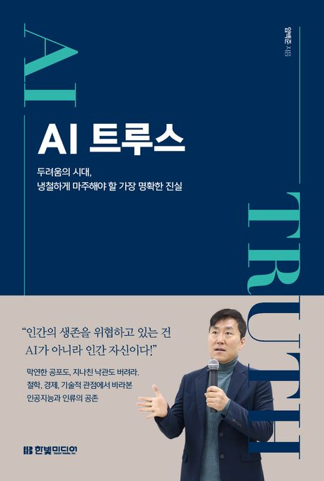

### 한줄평

> 다가올 미래에 대한 두려움과 기대를 동시에 안겨주는 책. 개발자로서 인공지능을 이해하고, 앞으로 나아가야 할 방향을 깊이 고민하게 만든다.

### 후기

ChatGPT, Copilot... 어느새 나도 모르게 인공지능이 내 코드 작성을 도와주는 것은 물론, 아이디어를 함께 논의하는 것이 자연스러운 일이 되어버렸다. 이 책은 인공지능이 어떻게 발전해왔는지, 그리고 앞으로 어떤 방향으로 나아갈지에 대해 심도 있게 이야기한다. 오랜만에 정말 흥미롭게 읽은 동시에, 개발자로서 많은 생각을 하게 해준 책이었다.

개발자로서 가장 흥미로웠던 부분은 단연코 **'코딩의 종말'** 파트였다. AI가 개발자의 일을 대체할 수 없다고 생각해왔지만, 이 책을 통해 AI가 이미 많은 부분에서 개발자의 역할을 대신하고 있다는 것을 깨달았다. 더 나아가, 내가 모르는 영역에서 더욱 발전된 AI 기술들이 활발히 연구되고 있다는 사실도 알게 되었다. 그동안 내가 가졌던 'AI는 개발자의 자리를 위협하지 않는다'라는 생각이 너무 단순한 것이었음을 깨달은 순간이었다.

그러나 이 책이 전하는 메시지는 단순히 **'AI가 개발자를 대체한다'**가 아니다. 진정한 가치는 **'문제를 해결하는 능력'**에 있다는 점을 다시금 생각하게 한다. AI가 개발자의 일을 일부 대체할 수는 있어도, 그것은 단순히 문제를 해결하는 것이 아니라 문제를 해결하는 방법을 제시해줄 뿐이다. 결국 문제를 해결하는 최종적인 선택과 실행은 인간의 몫이다. 그렇기 때문에 개발자는 AI와 협력해 더욱 효과적으로 문제를 해결하는 방법을 찾아야 한다. 그것이 곧 개발자가 가진 가치이자, AI와의 차별점이라는 것이라 생각이 들었다.

책을 읽으며 가장 인상 깊었던 문장은 **_'당신을 대체하는 것은 인공지능이 아니라, 인공지능을 활용하는 다른 사람이다.'_**라는 문구였다. 이 문장은 정말 많은 생각을 하게 만들었고, 개발자로서 내가 앞으로 어떤 방향으로 나아가야 할지 방향을 제시해 주는것 같았다. 코드를 작성하는 것도 중요하지만, 더 중요한 것은 코드를 읽고 이해하며, 그것을 어떻게 효율적으로 활용할 수 있는지 고민하는 것이다. 단순히 AI의 도움을 받는 것에 만족하지 않고, AI를 내 도구로 삼아 능동적으로 문제를 해결할 수 있어야 한다고 생각이 들었다.

나는 더 이상 AI를 단순한 도구로만 보지 않기로 결심했다. AI는 나의 경쟁 상대가 아니라, 나를 더 나은 개발자로 만들어주는 든든한 파트너다. 나는 AI와 경쟁이 아니라 공존을 통해 새로운 가능성을 열어가는 개발자가 되고자 한다. 이 책을 읽고 나의 방향을 다시 한번 정립할 수 있게 해준 점에 감사하며, 앞으로 나아가야 할 길을 더욱 열심히 걸어가야겠다는 다짐을 하게 해준 책이었다.
