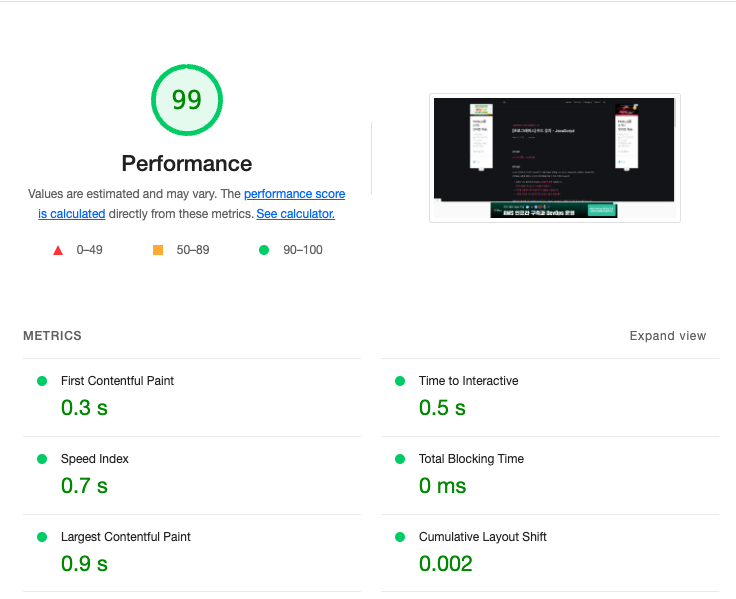
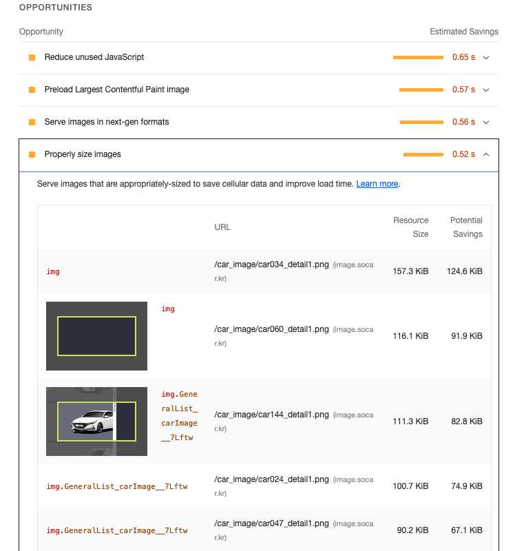

### Lighthouse란?

> Lighthouse는 웹 페이지의 품질을 향상시키기 위한 오픈 소스, 자동화된 도구입니다. 모든 웹 페이지, 공용 페이지 또는 인증이 필요한 웹 페이지에 대해 실행할 수 있습니다. 성능, 접근성, SEO 등에 대한 검사를 할 수 있다.

사이트의 성능이 저하되면 사용자가 떠나고 매출이 감소합니다. 반대로 말하면 성능이 향상되면 그만큼 사용자가 늘고 매출이 오른다는 것을 의미합니다. 그러나 웹 페이지가 이러한 표준을 충족하는지 확인하는 것은 복잡하고 시간이 많이 걸리는 프로세스입니다.

이러면 문제를 해결하기 위해 Lighthouse가 등장했습니다. Lighthouse를 이용하여 웹사이트의 성능 점수를 측정하고 개선 가이드를 확인함으로써 어떤 부분을 중점적으로 분석하고 최적화해야 손쉽게 알 수 있게 되었습니다.

### Lighthouse 셋팅

F12(Window), 혹은 Cmd + Shift + i(Mac) 키를 눌러 크롬의 개발자도구를 열고 Lighthouse 탭을 클릭해줍니다.
탭을 클릭하게 되면 **Mode, Device, Categories**를 선택하고 오른쪽 Analyze Page load 버튼을 눌러 분석을 진행합니다.

가장 기본적인 셋팅인 **Navigation / Desktop / Performance**를 선택하여 진행하였습니다.

| Mode           | Description                                                             |
| -------------- | ----------------------------------------------------------------------- |
| **Navigation** | Lighthouse의 기본 값으로, 초기 페이지 로딩 시 발생하는 성능 문제를 분석 |
| **Timespan**   | 사용자가 정의한 시간 동안 발생한 성능 문제를 분석                       |
| **Snapshot**   | 현재 상태의 성능 문제를 분석                                            |

| Category                | Description                                                    |
| ----------------------- | -------------------------------------------------------------- |
| **Perpormance**         | 웹 페이지의 로딩 과정에서 발생하는 성능 문제를 분석            |
| **Accessibility**       | 서비스의 사용자 접근성 문제를 분석                             |
| **Best practices**      | 웹사이트의 보안 측면과 웹 개발의 최신 표준에 중점을 두고 분석  |
| **SEO**                 | 검색 엔진에서 얼마나 잘 크롤링되고 검색 결과에 표시되는지 분석 |
| **Progressive Web App** | 서비스 워커와 오프라인 동작 등, PWA와 관련된 문제를 분석       |

### Lighthouse 결과

분석을 진행하였으면 결과과 나오게 됩니다. 각 요소에 관한 내용을 정리해봤습니다.

| **First Contentful Paint(FCP)** | 페이지가 로드될 때 브라우저가 DOM 콘텐츠의 첫 번째 부분을 렌더링하는 데 걸리는 시간에 관한 지표입니다. 총점을 계산할 때, 10%의 가중치를 갖습니다. |
| **Spreed Index(SI)** | 페이지 로드 중에 콘텐츠가 시각적으로 표시되는 속도를 나타내는 지표입니다. 총점을 계산할 때, 10%의 가중치를 갖습니다. |
| **Largest Contentful Paint(LCP)** | 페이지가 로드될 때 화면 내에 있는 가장 큰 이미지나 텍스트 요소가 렌더링되기까지 걸리는 시간을 나타내는 지표입니다. 총점을 계산할 때, 25%의 가중치를 갖습니다. |
| **Time to Interactive(TTI)** | 사용자가 페이지와 상호 작용이 가능한 시점까지 걸리는 시간을 측정한 지표로 상호 작용이란 클릭 또는 키보드 누름 같은 사용자 입력을 의미합니다. 총점을 계산할 때, 10%의 가중치를 갖습니다. |
| **Total Blocking Time(TBT)** | 페이지가 클릭, 키보드 입력 등의 사용자 입력에 응답하지 않도록 차단된 시잔을 총합한 지표입니다. 총점을 계산할 때, 30%의 가중치를 갖습니다. |
| **Cumulative Layout Shift(CLS)** | 페이지 로드 과정에서 발생하는 예기치 못한 레이아웃 이동을 측정한 지표이다. 레이아웃 이동이란 화면상에서 요소의 위치나 크기가 순간적으로 변하는 것을 말한다. 총점을 계산할 때, 15%의 가중치를 갖는다. |

### Lighthouse 성능 개선

_
개선점이 있는 것을 보여드리기 위해 다른 사이트 결과를 사용했습니다.
_

결과창에서 좀 더 아래로 내려보면 OPPORTUNITIES와 DIAGNOSTICS섹션이 있습니다. 이 두 섹션은 **웹페이지의 문제점과 해결 방안, 그리고 문제를 해결함으로써 얻을 수 있는 이점이 무엇인지 보여 줍니다.** 이것을 통해 해당 서비스의 어느 부분을 개선해야 성능을 향상할 수 있는지 쉽게 파악할 수 있습니다.

위 이미지를 보시게되면 Resource Size가 현재 적용되어 있는 사이즈이고 Potential Savings가 최적화 시 적용될 사이즈를 알려주고 있습니다. 이렇게 해당 영역을 체크하고 성능 최적화를 진행할 수 있습니다.

|**OPPORTUNITIES**|페이지를 더욱 빨리 로드하는 데 잠재적으로 도움이되는 제안을 나열합니다.|
|**DIAGNOSTICS**|로드 속도와 직접적인 관계는 없지만 성능과 관련된 기타 정보를 보여 줍니다.|

#### 정리

Lighthouse로 제 블로그 페이지의 성능을 확인해봤습니다. 99점으로 매우 좋게 나오는 것을 볼 수 있는데 그 만큼 이 글을 보시는 분들이 빠르게 화면을 보시고 글을 잘 보시고 가셨으면 좋겠습니다!

피드백은 언제나 환영입니다. 😊
