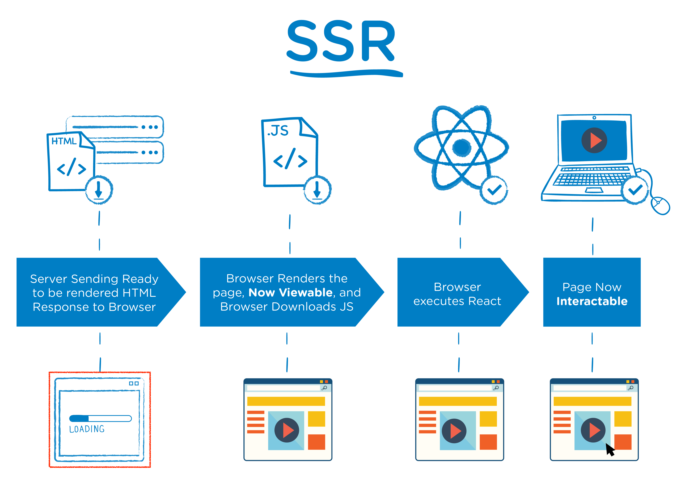
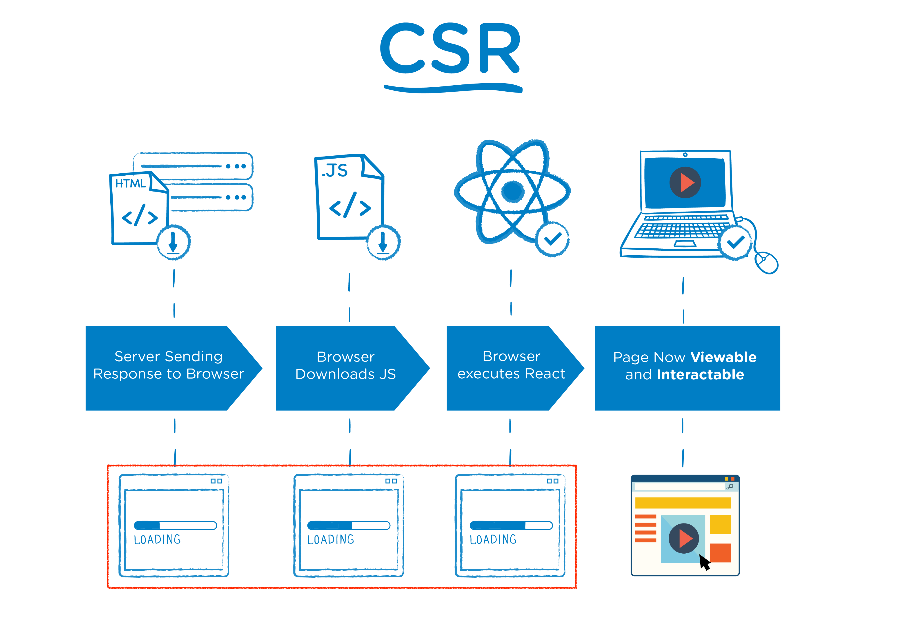
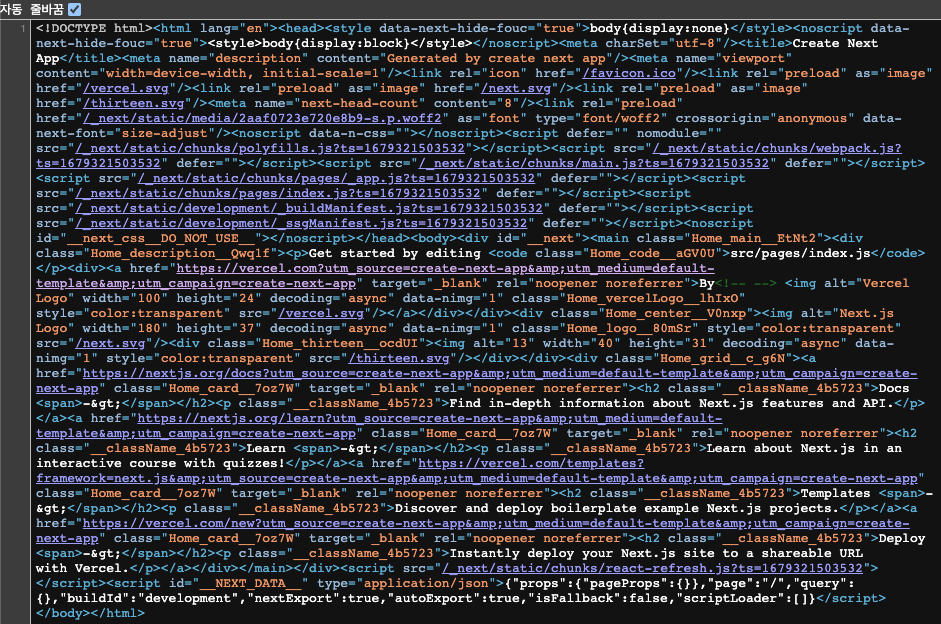
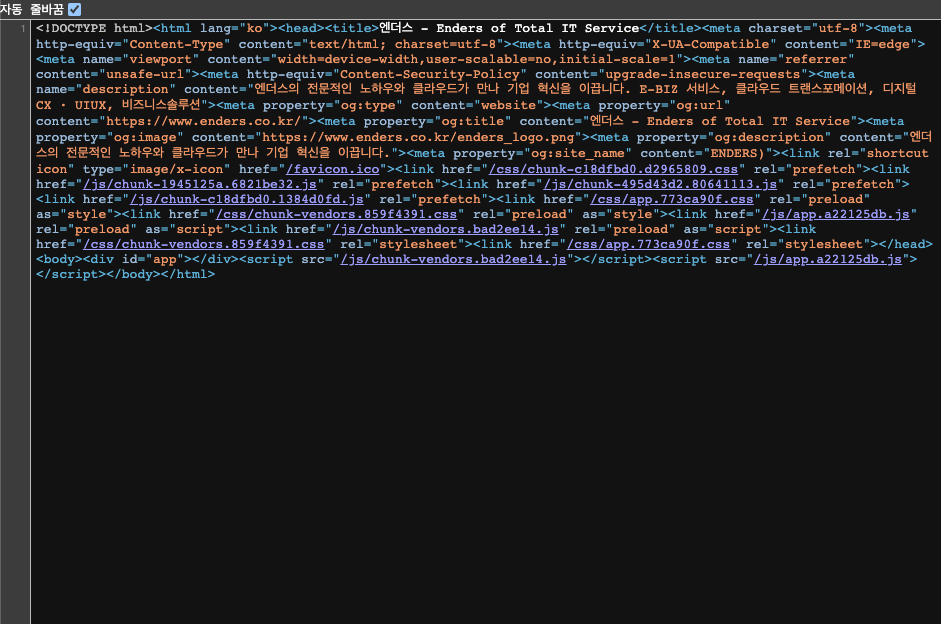

### Rendering and SSR / CSR

**렌더링은 서버에서 클라이언트에게 전송한 콘텐츠(HTML, CSS, JavaScript)를 이용해 웹 페이지를 만들어내는 과정을 의미합니다.** 현대 웹 개발에서 웹 페이지를 렌더링하는 방식으로 주로 Server-Side Rendering (SSR)과 Client-Side Rendering (CSR)을 자주 사용합니다.

### Server-Side Rendering (SSR)

_
출처: <a href="https://medium.com/walmartglobaltech/the-benefits-of-server-side-rendering-over-client-side-rendering-5d07ff2cefe8" target="_blank">The Benefits of Server Side Rendering Over Client Side Rendering</a>
_

Server-Side Rendering 그대로 해석하면 서버 측 렌더링입니다. SSR은 말 그대로 웹 페이지를 클라이언트의 브라우저로 보내기 전에 렌더링이 서버에서 수행됩니다. **즉, 사용자가 웹 페이지를 요청하면 서버는 필요한 모든 데이터와 내용이 포함된 HTML 문서를 생성한 다음 클라이언트의 브라우저로 전송됩니다.**

서버측에서 이미 데이터와 내용이 포함된 HTML을 보내주기 때문에 클라이언트의 브라우저는 미리 렌더링된 HTML을 다운로드하고 표시하기만 하면 됩니다.

### Client-Side Rendering (CSR)

_
출처: <a href="https://medium.com/walmartglobaltech/the-benefits-of-server-side-rendering-over-client-side-rendering-5d07ff2cefe8" target="_blank">The Benefits of Server Side Rendering Over Client Side Rendering</a>
_

Client-Side Rendering 클라이언트 측 렌더링, SSR과 반대로 CSR은 렌더링이 클라이언트의 브라우저에서 수행됩니다. **사용자가 웹 페이지를 요청하면 서버는 페이지를 렌더링하는 데 필요한 최소한의 HTML, CSS 및 JavaScript를 보냅니다.** 브라우저가 초기 콘텐츠를 다운로드하면 JavaScript를 사용하여 콘텐츠를 동적으로 렌더링하고 필요에 따라 페이지를 업데이트합니다.

CSR은 초기 로드 시간이 느려질 수 있지만 보다 동적이고 대화형 웹 응용 프로그램을 사용할 수 있습니다. 특히 동적 콘텐츠가 많은 웹일 경우 사용자 환경이 더 원활하고 응답성이 향상됩니다.

### SSR / CSR 차이

_
위 SSR - Next.js / 아래 CSR - Vue.js
_

페이지 소스보기를 하게되면 SSR과 CSR의 차이를 분명하게 느끼실 수 있습니다. SSR의 경우 서버에서 렌더링 하기 때문에 소스에 HTML 코드들이 표시되는 반면, CSR은 JavaScript를 사용하여 클라이언트에서 콘텐츠를 동적으로 렌더링하기 때문에 페이지 소스에서 HTML 코드를 찾아볼 수 없습니다.

### SSR 장-단점

- 장점
  - **향상된 SEO:** 웹 페이지가 서버에서 렌더링되고 브라우저로 전송되므로 검색 엔진이 내용을 쉽게 탐색할 수 있습니다.
  - **빠른 초기 페이지 로드:** SSR은 HTML 콘텐츠가 서버에서 생성되어 클라이언트의 브라우저로 전송되므로 더 빠른 초기 페이지 로드를 제공할 수 있습니다.
- 단점
  - **서버 부하:** 서버는 각 요청에 대해 HTML 내용을 생성하므로 서버 부하가 증가하여 서버 비용이 증가할 수 있습니다.
  - **후속 페이지의 느린 로드 속도:** 초기 페이지 로드는 더 빠를 수 있지만, 각 페이지는 서버에서 생성되어 전송되어야 하므로 이후 페이지 로드는 더 느릴 수 있습니다.

### CSR 장-단점

- 장점
  - **더 나은 사용자 환경:** CSR는 클라이언트 측에서 렌더링하기 때문에 보다 동적이고 전체 페이지를 새로 고칠 필요 없어 더 나은 사용자 환경을 제공합니다.
  - **낮은 서버 부하:** 서버에 대한 부하를 줄여 서버 비용을 낮출 수 있습니다.
- 단점
  - **TTFP(First-Contentful-Paint)가 느림:** TTFP는 브라우저가 페이지의 첫 번째 콘텐츠를 렌더링하는 데 걸리는 시간으로 CSR에서는 이 시간이 비교적 느립니다.
  - **SEO에 불리:** CSR는 초기에 별다른 정보가 없어 웹 콘텐츠 정보를 수집하지 못해 SEO에 불리합니다.

#### 정리

Next.js를 공부하다 삘받아서 SSR과 CSR에 대해 정리해보았습니다!

피드백은 언제나 환영입니다. 😊
