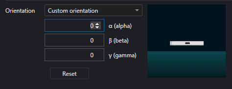
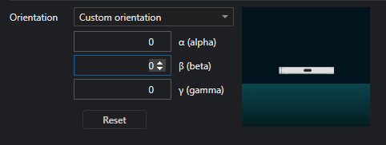
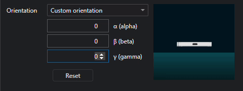
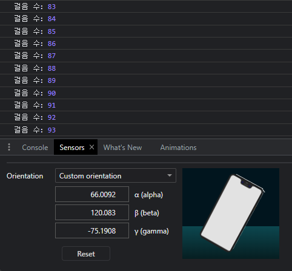

이번에 새싹톤에 참가해서 플로깅 서비스를 만들었습니다. 걸음수 측정을 위해 Device Orientation Event를 사용했는데 사용 방법을 정리해보았습니다. <br />

### Device Orientation Event

Device Orientation Event는 **모바일 기기의 방향과 회전 정보**를 제공하는 JavaScript 이벤트입니다. 사용 중인 기기가 가로 모드인지 세로 모드인지, 기기가 얼마나 회전했는지 등을 알 수 있게 해줍니다.

Device Orientation Event에는 세 개의 속성(alpha, beta, gamma)이 있으며 각각의 값은 기기의 방향과 회전을 설명하는데 사용됩니다.

- **alpha**: 기기의 z축 중심으로의 회전을 나타냅니다. 값의 범위는 0부터 360도까지이며, 0도는 기기가 북쪽을 가리키는 것을 의미합니다.
- **beta**: 기기의 x축 중심으로의 회전을 나타냅니다. 값의 범위는 -180부터 180도까지이며, 0도는 기기가 수직으로 일자를 이루는 것을 의미합니다.
- **gamma**: 기기의 y축 중심으로의 회전을 나타냅니다. 값의 범위는 -90부터 90도까지이며, 0도는 기기가 수평을 이루는 것을 의미합니다.

<center>



</center>
_<center>크롬 개발자 도구 Sensors 탭</center>_

### Device Orientation Event를 이용한 걸음 수 측정 순서 및 코드

저는 걸음 수를 측정의 가벼운 구현을 위해 **beta** 값만 사용하여 구현하였습니다.

1. Device Orientation Event를 이용해 beta 값의 변화를 감지합니다.
2. 이전 beta 값과 현재 beta 값의 차이를 계산합니다.
3. 이전 값과 현재 값의 차이가 10보다 크면 걸음을 감지한 것으로 판단합니다.
4. 이전 값과 현재 값의 차이가 -10보다 작으면 걸음이 끝난 것으로 판단합니다.
5. 걸음이 감지되면 stepCount를 1 증가시킵니다.

- isStepDetected는 걸음 수를 중복으로 측정하지 않기 위해 사용합니다.

```javascript
let previousBeta = null;
let isStepDetected = false;
let stepCount = 0;

function startStepCounting() {
  // 걸음 수 측정을 위해 이벤트 리스너 등록
  window.addEventListener("deviceorientation", (event) => {
    const { beta } = event;

    // 이전 beta 값이 null인 경우 초기화
    if (previousBeta === null) {
      previousBeta = beta;
      return;
    }

    // 이전 값과 현재 값의 차이 계산
    const deltaBeta = beta - previousBeta;

    // 걸음을 감지하는 조건 설정
    if (!isStepDetected && deltaBeta > 10) {
      isStepDetected = true;
    } else if (isStepDetected && deltaBeta < -10) {
      isStepDetected = false;
      stepCount++;
    }

    previousBeta = beta;
    displayStepCount();
  });
}

// 걸음 수 출력
function displayStepCount() {
  console.log("걸음 수:", stepCount);
}

// 걸음 수 측정 시작
startStepCounting();
```



#### 정리

[IOS에서 Device Orientation Event 권한 얻는 방법](https://leejams.github.io/ios-device-orientation/){:target="\_blank"}<br />
[MDN - DeviceOrientationEvent](https://developer.mozilla.org/en-US/docs/Web/API/DeviceOrientationEvent){:target="\_blank"}

걸음수 측정을 위해 열심히 개발하다 배운 것을 정리하게 되었습니다.<br />

피드백은 언제나 환영입니다. 😊
