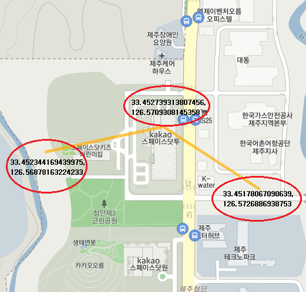
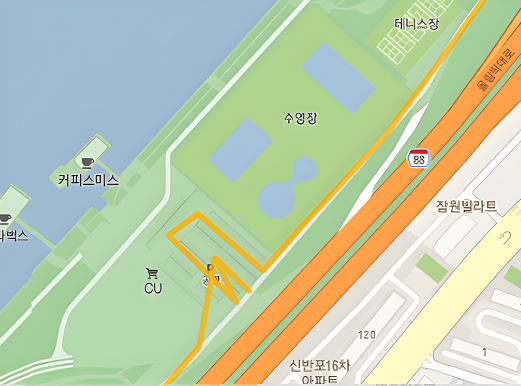

새싹톤에서 플로깅 서비스 만들면서 지나온 경로를 실시간으로 보여주고 싶어 Geolocation API와 카카오맵 API를 사용해 현재 내가 움직이는 경로를 지도에 실시간으로 그리는 기능을 구현했습니다.

### Geolocation API

Geolocation API는 사용자의 동의 하에 웹 애플리케이션에서 위치 정보에 접근할 수 있는 API입니다. Geolocation에 접근하기 위해서는 사용자의 위치 정보에 접근할 수 있는 권한이 필요하며, 권한을 얻지 못한 경우 사용자의 위치 정보를 가져올 수 없습니다.

권한을 얻는데 성공 했다면 getCurrentPosition() 메서드를 사용하여 사용자의 현재 위치를 가져올 수 있습니다.

Geolocation API를 사용할 수 있는지 확인하고 권한을 요청하고 사용자의 위치 정보를 가져오는 코드는 아래와 같습니다.

```javascript
if (navigator.geolocation) {
  // Geolocation API를 사용할 수 있는 경우
  navigator.geolocation.getCurrentPosition(
    (position) => {
      // 위치 정보를 가져오는데 성공한 경우

      // position 객체에서 좌표 정보를 가지고 옵니다
      const lat = position.coords.latitude; // 위도
      const lon = position.coords.longitude; // 경도
    },
    (error) => {
      // 위치 정보를 가져오는데 실패한 경우`
    }
  );
} else {
  // Geolocation API를 사용할 수 없는 경우
}
```

**_Geolocation API는 https 프로토콜을 사용하는 환경에서만 사용할 수 있습니다._**

### MAPS API?

Kakao 지도 API는 웹사이트와 모바일 애플리케이션에서 지도를 이용한 서비스를 제작할 수 있도록 다양한 기능을 제공하고 있습니다.<br />
API를 이용하기 위해서는 키를 발급받고 앱을 등록해야하는데 아래 링크에 들어가시면 자세한 내용을 확인하실 수 있습니다.

[Kakao Developers](https://developers.kakao.com/)

카카오맵 API 에서는 개발자들을 위해 만들어둔 다양한 샘플과 활용 방법들을 볼 수 있는데 저는 원, 선, 사각형, 다각형 표시하기 Sample을 활용하여 실시간으로 동선을 그리는 기능을 구현했습니다.

### 선 표시하기 - 기본

<center>

</center>
_<center>선 그리기 좌표</center>_

선을 표시하기 위해서는 라인에 대한 좌표 배열과 Polyline 객체를 생성해야합니다. Polyline 객체는 지도에 선을 표시할 수 있는 객체로 Polyline 객체를 생성할 때 지도 객체와 옵션을 지정해야합니다.

```javascript
const mapContainer = document.getElementById("map"); // 지도를 표시할 div
const mapOption = {
  center: new kakao.maps.LatLng(33.450701, 126.570667), // 지도의 중심좌표
  level: 3, // 지도의 확대 레벨
};

const map = new kakao.maps.Map(mapContainer, mapOption); // 지도를 생성합니다

// 선을 구성하는 좌표 배열입니다. 이 좌표들을 이어서 선을 표시합니다
const linePath = [
  new kakao.maps.LatLng(33.452344169439975, 126.56878163224233),
  new kakao.maps.LatLng(33.452739313807456, 126.5709308145358),
  new kakao.maps.LatLng(33.45178067090639, 126.5726886938753),
];

// 지도에 표시할 선을 생성합니다
const polyline = new kakao.maps.Polyline({
  path: linePath, // 선을 구성하는 좌표배열 입니다
  strokeWeight: 5, // 선의 두께 입니다
  strokeColor: "#FFAE00", // 선의 색깔입니다
  strokeOpacity: 0.7, // 선의 불투명도 입니다 1에서 0 사이의 값이며 0에 가까울수록 투명합니다
  strokeStyle: "solid", // 선의 스타일입니다
});

// 지도에 선을 표시합니다
polyline.setMap(map);
```

### 실시간으로 선 표시하기 feat. React

<center>

</center>
_<center>실시간 동선</center>_

초기 진입 시에 Geolocation API을 사용할 수 있는지 확인하고 권한을 요청하는 과정을 거친 후 성공한다면 현재 위치를 기준으로 지도를 생성하고, 현재 위치를 기준으로 맵을 표시하는 코드입니다.

```javascript
const [map, setMap] = useState(null);
const [positionArr, setPositionArr] = useState([]);

const successHandler = (position) => {
  // 초기 맵 셋팅
  let mapContainer = document.getElementById("map"), // 지도를 표시할 div
    mapOption = {
      center: new kakao.maps.LatLng(
        position.coords.latitude, // 현재 위치 기반 위도
        position.coords.longitude // 현재 위치 기반 경도
      ), // 지도의 중심좌표
      level: 3, // 지도의 확대 레벨
    };

  let kakaoMap = new kakao.maps.Map(mapContainer, mapOption); // 지도 생성

  // 라인을 그리기 위해 Map 객체를 state에 저장
  setMap(kakaoMap);
};

const errorHandler = (error) => {
  // Geolocation API를 사용할 수 없는 경우
  alert("GPS를 사용할 수 없습니다. 위치정보 설정을 확인해주세요.");
};

useEffect(() => {
  const getCurLocation = () => {
    if (navigator.geolocation) {
      navigator.geolocation.getCurrentPosition(successHandler, errorHandler);
    } else {
      alert("GPS를 사용할 수 없습니다. 위치정보 설정을 확인해주세요.");
    }
  };
  getCurLocation();
}, []);
```

맵이 셋팅되면 5초마다 현재 위치를 가져오고 그 위치를 배열에 저장하여 다음 위치와 비교하여 선을 그리는 기능의 코드입니다.

```javascript
// 라인을 그리는 함수
const makeLine = useCallback(
  (position) => {
    let linePath = position;

    var polyline = new kakao.maps.Polyline({
      path: linePath,
      strokeWeight: 5,
      strokeColor: "#FFAE00",
      strokeOpacity: 0.7,
      strokeStyle: "solid",
    });

    // 지도에 선을 표시합니다
    polyline.setMap(map);
  },
  [map]
);

// 라인을 그리기 위한 좌표 배열을 만들어주는 함수
const setLinePathArr = (position) => {
  const moveLatLon = new kakao.maps.LatLng(
    position.coords.latitude,
    position.coords.longitude
  );
  const newPosition = positionArr.concat(moveLatLon);
  setPositionArr(newPosition);

  // 라인을 그리는 함수
  makeLine(newPosition);
};

useEffect(() => {
  // map이 변경될 시 확인하고 map이 존재하면 5초마다 현재 위치를 가져오는 함수를 실행
  if (map) {
    let interval = setInterval(() => {
      navigator.geolocation.getCurrentPosition(setLinePathArr);
    }, 5000);

    return () => {
      clearInterval(interval);
    };
  }
}, [map]);
```

#### 정리

이렇게 Geolocation API와 카카오맵 API를 사용하여 실시간으로 동선을 그리는 기능을 구현하는 방법을 정리해보았습니다. 이 글을 읽고 계신 분들에게 도움이 되었으면 좋겠습니다. <br />
다른 방법으로도 구현할 수 있을 것 같은데 더 좋은 방법이 있다면 알려주시면 감사하겠습니다.

피드백은 언제나 환영입니다. 😊

[MDN - Geolocation API](https://developer.mozilla.org/ko/docs/Web/API/Geolocation_API)
[Kakao Maps API - Home](https://apis.map.kakao.com/)
[Maps API - 원, 선, 사각형, 다각형 표시하기 Sample](https://apis.map.kakao.com/web/sample/drawShape/){:target="\_blank"}
