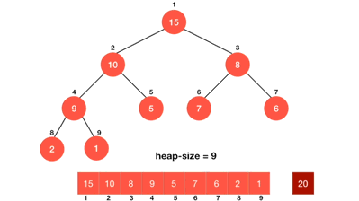

##### 문제 출처

[Lv.2 디펜스 게임 - JavaScript](https://school.programmers.co.kr/learn/courses/30/lessons/142085?language=javascript){:target="\_blank"}

##### 숙지 사항

> 자료구조 힙(Heap) 중에 최대 힙(Max Heap)을 숙지하고 진행하는 것을 권장합니다.

##### 문제 설명

준호는 요즘 디펜스 게임에 푹 빠져 있습니다. 디펜스 게임은 준호가 보유한 병사 n명으로 연속되는 적의 공격을 순서대로 막는 게임입니다. 디펜스 게임은 다음과 같은 규칙으로 진행됩니다.

- 준호는 처음에 **병사 n명**을 가지고 있습니다.
- 매 라운드마다 **enemy[i]마리의 적**이 등장합니다.
- **남은 병사 중 enemy[i]명 만큼 소모하여 enemy[i]마리의 적을 막을 수 있습니다.**
  - 예를 들어 남은 병사가 7명이고, 적의 수가 2마리인 경우, 현재 라운드를 막으면 7 - 2 = 5명의 병사가 남습니다.
  - **남은 병사의 수보다 현재 라운드의 적의 수가 더 많으면 게임이 종료됩니다.**
- 게임에는 무적권이라는 스킬이 있으며, **무적권을 사용하면 병사의 소모없이 한 라운드의 공격을 막을 수 있습니다.**
- **무적권은 최대 k번** 사용할 수 있습니다.

준호는 무적권을 적절한 시기에 사용하여 **최대한 많은 라운드를 진행**하고 싶습니다.

준호가 처음 가지고 있는 병사의 수 n, 사용 가능한 무적권의 횟수 k, 매 라운드마다 공격해오는 적의 수가 순서대로 담긴 정수 배열 enemy가 매개변수로 주어집니다. 준호가 몇 라운드까지 막을 수 있는지 return 하도록 solution 함수를 완성해주세요.

##### 제한 조건

- 1 ≤ n ≤ 1,000,000,000
- 1 ≤ k ≤ 500,000
- **1 ≤ enemy의 길이 ≤ 1,000,000**
- 1 ≤ enemy[i] ≤ 1,000,000
- enemy[i]에는 i + 1 라운드에서 공격해오는 적의 수가 담겨있습니다.
- 모든 라운드를 막을 수 있는 경우에는 enemy[i]의 길이를 return 해주세요.

##### 예시

입출력 예

| n   | k   | enemy                 | return |
| --- | --- | --------------------- | ------ |
| 7   | 3   | [4, 2, 4, 5, 3, 3, 1] | 5      |
| 2   | 4   | [3, 3, 3, 3]          | 4      |

##### 풀이



```javascript
// MaxHeap을 구현한다.
// MaxHeap에 관한 코드는 따로 포스팅을 하겠습니다.
class MaxHeap {
  constructor() {
    this.val = [];
  }
  insert(val) {
    this.val.push(val);
    this.bubbleUp();
  }
  bubbleUp() {
    let idx = this.val.length - 1;
    const element = this.val[idx];
    while (idx > 0) {
      let parentIdx = Math.floor((idx - 1) / 2);
      let parent = this.val[parentIdx];
      if (element <= parent) break;
      this.val[parentIdx] = element;
      this.val[idx] = parent;
      idx = parentIdx;
    }
  }
  extractMax() {
    if (!this.val.length) return undefined;

    const max = this.val[0];
    const end = this.val.pop();
    if (this.val.length > 0) {
      this.val[0] = end;
      this.sinkDown();
    }
    return max;
  }
  sinkDown() {
    let idx = 0;
    const element = this.val[0];
    while (true) {
      const leftIdx = idx * 2 + 1;
      const leftVal = this.val[leftIdx];
      const rightIdx = idx * 2 + 2;
      const rightVal = this.val[rightIdx];

      if (element < leftVal && element < rightVal) {
        const maxIdx = leftVal > rightVal ? leftIdx : rightIdx;
        this.val[idx] = this.val[maxIdx];
        this.val[maxIdx] = element;
        idx = maxIdx;
      } else if (element < leftVal) {
        this.val[idx] = leftVal;
        this.val[leftIdx] = element;
        idx = leftIdx;
      } else if (element < rightVal) {
        this.val[idx] = rightVal;
        this.val[rightIdx] = element;
        idx = rightIdx;
      } else {
        break;
      }
    }
  }
}

function solution(n, k, enemy) {
  let answer = 0;

  // 구현한 MapHeap을 선언합니다.
  const maxHeap = new MaxHeap();

  // enemy 배열을 하나씩 확인해줍니다.
  for (let i = 0; i < enemy.length; i++) {
    // maxHeap에 들어온 적의 수를 넣어줍니다.
    // (maxHeap에서 나중에 가져올때 들어간 값들 중 가장 큰 값부터 가져올 수 있다.)
    maxHeap.insert(enemy[i]);

    // 병사 n에서 들어온 적의 수를 빼줍니다.
    n -= enemy[i];

    // 병사가 0명 이하가 됐을 때..
    if (n < 0) {
      // 무적권 스킬이 남아있으면..
      if (k) {
        // maxHeap에서 가장 큰 값을 가져온다.
        // (라운드 중 병력 소모가 가장 많은 값)
        const max = maxHeap.extractMax();

        // n에 가져온 가장 큰 값을 더해주고 무적권을 하나 감소시켜준다.
        n += max;
        k--;

        // 만약 무적권 스킬이 남아있지 않다면 그대로 루프를 종료시킨다.
      } else break;
    }

    // 위의 상황이 다 이뤄졌을 경우 answer을 하나 증가시킨다.
    answer++;
  }

  return answer;
}

console.log(solution(7, 3, [4, 2, 4, 5, 3, 3, 1])); // 5
console.log(solution(2, 4, [3, 3, 3, 3])); // 4
```

##### 정리

자료구조 힙에 관하여 알면 쉽게 풀 수 있는 문제였습니다. 처음에는 힙이 아니라 쉽게 객체를 이용하여 문제를 풀어봤는데 테스트 6번만 시간 초과에 걸려서 힙을 구현하여 문제를 풀어봤습니다.<br/>

피드백은 언제나 환영입니다. 😊
