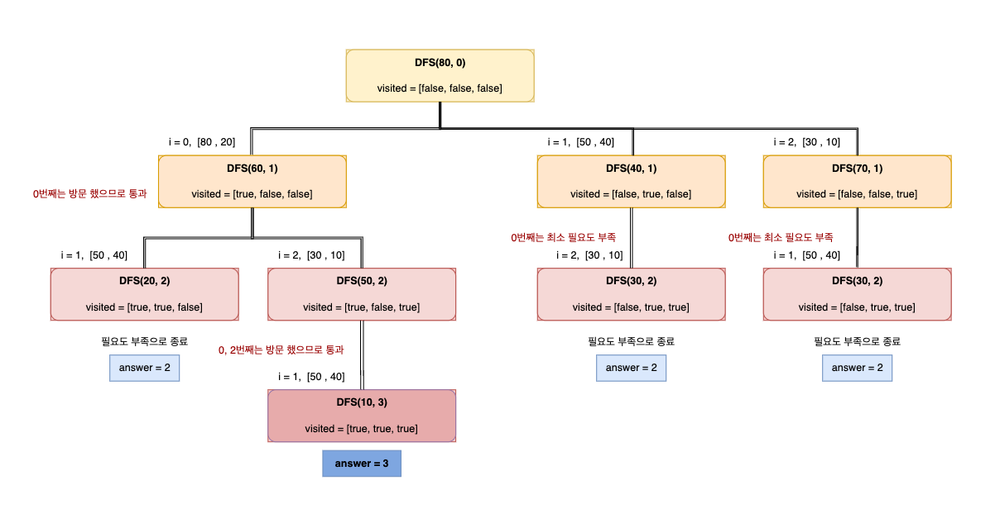

##### 문제 출처

[Lv.2 피로도 - JavaScript](https://school.programmers.co.kr/learn/courses/30/lessons/87946?language=javascript){:target="\_blank"}

##### 문제 설명

XX게임에는 피로도 시스템(0 이상의 정수로 표현합니다)이 있으며, 일정 피로도를 사용해서 던전을 탐험할 수 있습니다. 이때, **각 던전마다 탐험을 시작하기 위해 필요한 "최소 필요 피로도"와 던전 탐험을 마쳤을 때 소모되는 "소모 피로도"가 있습니다. "최소 필요 피로도"는 해당 던전을 탐험하기 위해 가지고 있어야 하는 최소한의 피로도를 나타내며, "소모 피로도"는 던전을 탐험한 후 소모되는 피로도를 나타냅니다.** 예를 들어 "최소 필요 피로도"가 80, "소모 피로도"가 20인 던전을 탐험하기 위해서는 유저의 현재 남은 피로도는 80 이상 이어야 하며, 던전을 탐험한 후에는 피로도 20이 소모됩니다.

이 게임에는 하루에 한 번씩 탐험할 수 있는 던전이 여러개 있는데, **한 유저가 오늘 이 던전들을 최대한 많이 탐험하려 합니다.** 유저의 현재 피로도 k와 각 던전별 "최소 필요 피로도", "소모 피로도"가 담긴 2차원 배열 dungeons 가 매개변수로 주어질 때, 유저가 탐험할수 있는 최대 던전 수를 return 하도록 solution 함수를 완성해주세요.

##### 제한 사항

- k는 1 이상 5,000 이하인 자연수입니다.
- dungeons의 세로(행) 길이(즉, 던전의 개수)는 1 이상 8 이하입니다.
  - dungeons의 가로(열) 길이는 2 입니다.
  - **dungeons의 각 행은 각 던전의 ["최소 필요 피로도", "소모 피로도"] 입니다.**
  - **"최소 필요 피로도"는 항상 "소모 피로도"보다 크거나 같습니다.**
  - "최소 필요 피로도"와 "소모 피로도"는 1 이상 1,000 이하인 자연수입니다.
  - 서로 다른 던전의 ["최소 필요 피로도", "소모 피로도"]가 서로 같을 수 있습니다.

##### 예시

입출력 예

| k   | dungeons                  | return |
| --- | ------------------------- | ------ |
| 80  | [[80,20],[50,40],[30,10]] | 3      |

##### 풀이



```javascript
function solution(k, dungeons) {
  let answer = 0;
  // 방문했는지 확인하기 위한 배열
  const visited = Array.from({ length: dungeons.length }, () => false);

  // 완전탐색을 위한 DFS(남은 피로도, 진행단계)
  function DFS(hp, L) {
    // 던전의 수 만큼 반복한다.
    for (let i = 0; i < dungeons.length; i++) {
      // 방문하지 않았고 현재 남은 피로도가 최소 필요도 보다 크거나 같으면 실행
      if (!visited[i] && dungeons[i][0] <= hp) {
        // 현재 들어온 던전을 방문 처리
        visited[i] = true;

        // DFS(현재 피로도 - 방문 던전, 진행단계 + 1)
        DFS(hp - dungeons[i][1], L + 1);

        // DFS 종료 후 방문을 끝내준다.
        visited[i] = false;
      }
    }

    // 가장 깊이 들어간 진행단계를 answer에 넣어준다.
    answer = Math.max(answer, L);
  }

  DFS(k, 0);

  return answer;
}
```

##### 정리

DFS를 활용한 완전탐색 문제풀이였습니다. 그려둔 이미지를 통해 이해에 도움이 되길!<br/>
사용된 메서드와 문법에 대해 더 공부하고 싶으신 분은 **링크**를 클릭해주세요!

[Array.from() 메서드 - MDN](https://developer.mozilla.org/ko/docs/Web/JavaScript/Reference/Global_Objects/Array/from){:target="\_blank"}<br />

피드백은 언제나 환영입니다. 😊
