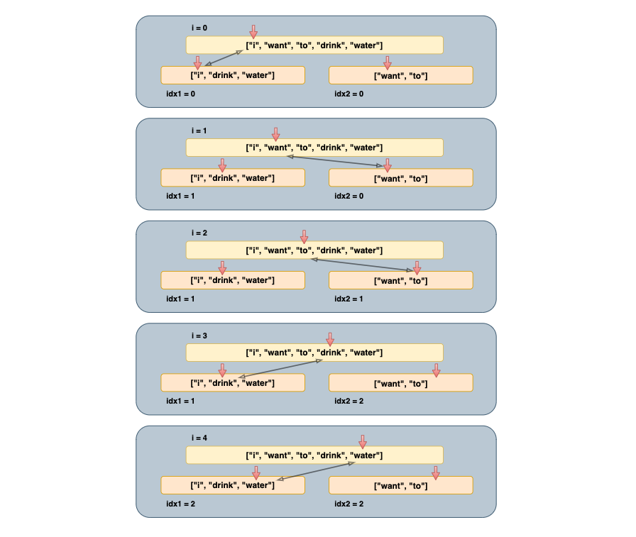

##### 문제 출처

[Lv.1 카드 뭉치 - JavaScript](https://school.programmers.co.kr/learn/courses/30/lessons/159994?language=javascript){:target="\_blank"}

##### 문제 설명

코니는 영어 단어가 적힌 카드 뭉치 두 개를 선물로 받았습니다. 코니는 다음과 같은 규칙으로 카드에 적힌 단어들을 사용해 원하는 순서의 단어 배열을 만들 수 있는지 알고 싶습니다.

- **원하는 카드 뭉치에서 카드를 순서대로 한 장씩 사용합니다.**
- **한 번 사용한 카드는 다시 사용할 수 없습니다.**
- **카드를 사용하지 않고 다음 카드로 넘어갈 수 없습니다.**
- **기존에 주어진 카드 뭉치의 단어 순서는 바꿀 수 없습니다.**

예를 들어 첫 번째 카드 뭉치에 순서대로 ["i", "drink", "water"], 두 번째 카드 뭉치에 순서대로 ["want", "to"]가 적혀있을 때 ["i", "want", "to", "drink", "water"] 순서의 단어 배열을 만들려고 한다면 첫 번째 카드 뭉치에서 "i"를 사용한 후 두 번째 카드 뭉치에서 "want"와 "to"를 사용하고 첫 번째 카드뭉치에 "drink"와 "water"를 차례대로 사용하면 원하는 순서의 단어 배열을 만들 수 있습니다.

**문자열로 이루어진 배열 cards1, cards2와 원하는 단어 배열 goal이 매개변수로 주어질 때, cards1과 cards2에 적힌 단어들로 goal를 만들 있다면 "Yes"를, 만들 수 없다면 "No"를 return하는 solution 함수를 완성해주세요.**

##### 제한 사항

- 1 ≤ cards1의 길이, cards2의 길이 ≤ 10
  - 1 ≤ cards1[i]의 길이, cards2[i]의 길이 ≤ 10
  - **cards1과 cards2에는 서로 다른 단어만 존재합니다.**
- **2 ≤ goal의 길이 ≤ cards1의 길이 + cards2의 길이**
  - 1 ≤ goal[i]의 길이 ≤ 10
  - **goal의 원소는 cards1과 cards2의 원소들로만 이루어져 있습니다.**
- cards1, cards2, goal의 문자열들은 모두 알파벳 소문자로만 이루어져 있습니다.

##### 예시

입출력 예

| cards1                  | cards2         | goal                                  | return |
| ----------------------- | -------------- | ------------------------------------- | ------ |
| ["i", "drink", "water"] | ["want", "to"] | ["i", "want", "to", "drink", "water"] | "Yes"  |
| ["i", "water", "drink"] | ["want", "to"] | ["i", "want", "to", "drink", "water"] | "No"   |

##### 풀이



```javascript
function solution(cards1, cards2, goal) {
  
  // cards1에 대한 인덱스 체크용
  let idx1 = 0;

  // cards2에 대한 인덱스 체크용
  let idx2 = 0;

  // goal을 for()문을 통해 하나씩 단어를 확인한다.
  for (let i = 0; i < goal.length; i++) {

    // 만약 현재 단어가 cards1의 셋팅한 인덱스에 해당된다면
    // idx1에 1을 더해줍니다.
    // *한 번 사용한 카드는 다시 사용할 수 없습니다.
    // cards1 해당 인덱스에 없다면 cards2의 셋팅한 인덱스를 확인합니다.
    if (cards1[idx1] === goal[i]) idx1++;
    else if (cards2[idx2] === goal[i]) idx2++;

    // 만약 두 카드뭉치의 현재 순서에 단어가 없으면 No를 반환해줍니다.
    else return "No";
  }

  // 무사히 for()문이 끝나면 Yes를 반환합니다.
  return "Yes";
}
```

##### 정리

재미있는 문제가 새로 나왔습니다. 오늘도 화이팅!<br/>
사용된 메서드와 문법에 대해 더 공부하고 싶으신 분은 **링크**를 클릭해주세요!

피드백은 언제나 환영입니다. 😊
