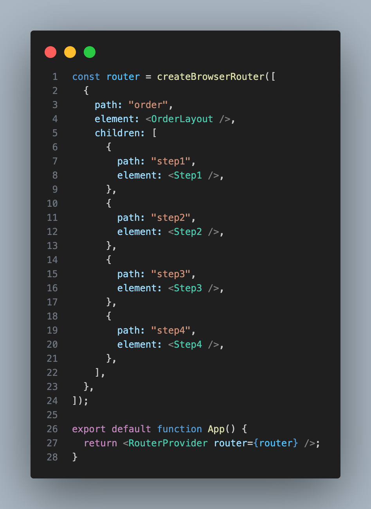
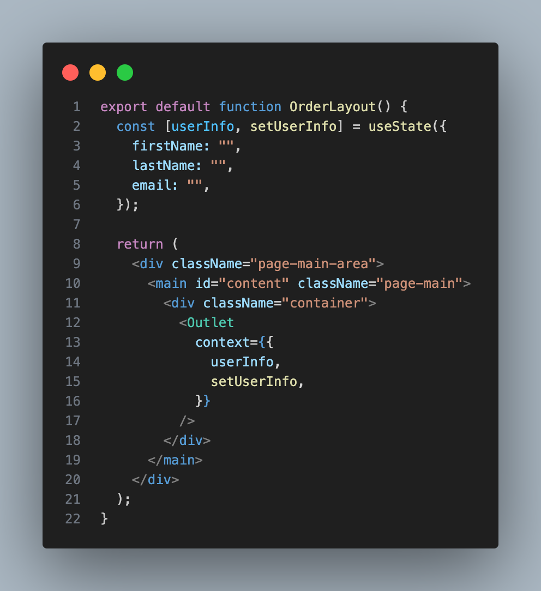
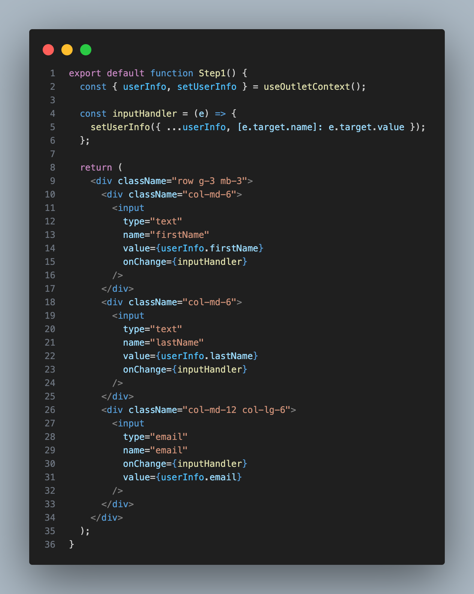

React 개발 중 라우터 children 컴포넌트들의 상태 값을 한번에 관리하는 방법을 고민하던 중, **useOutletContext()**를 발견했다. React Hook의 useContext()로도 관리할 수 있지만 React Router **&lt;Outlet />**에 내장되어 제공하는 기능으로 편하게 사용 가능했다.

### 사용 방법 - 주입

_
App.js
_

_
OrderLayout.js
_

Step 1, 2, 3, 4 컴포넌트를 children으로 받는 OrderLayout이 존재한다. 
이 컴포넌트들은 라우터 주소에 따라 **&lt;Outlet />** 컴퍼넌트에 대입되는데 **&lt;Outlet />**에 들어오는 컴퍼넌트에게 공유하고 싶은 상태를 **context={\{something, props}\}**를 사용하여 전달할 수 있다.

### 사용 방법 - 사용

_
Step1.js
_

받는 곳(children)에서는 **useOutletContext()**를 **import** 원하는 값을 가져와 사용이 가능하다. 
**useOutletContext()**를 사용하게 된다면 라우터가 이동되어 **&lt;Outlet />**에 대입되는 컴포넌트가 바껴도 상태는 OrderLayout에 존재하기 때문에 상태를 유지할 수 있다.

#### 정리

[useOutletContext() 공식자료 - React Router](https://reactrouter.com/en/main/hooks/use-outlet-context){:target="\_blank"} 

피드백은 언제나 환영입니다. 😊
