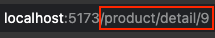
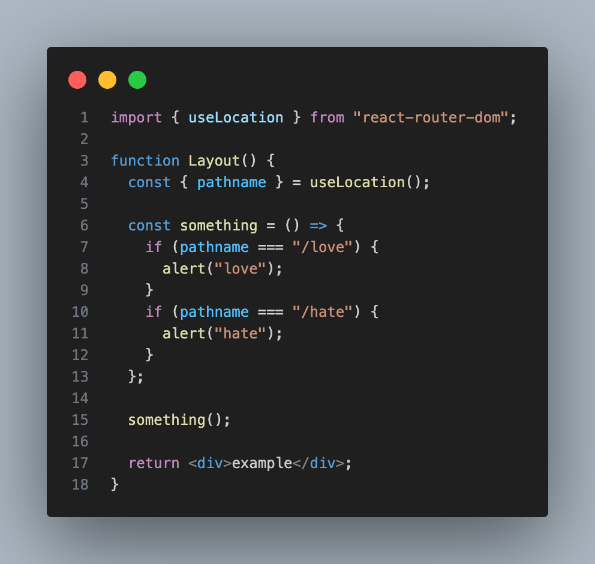

_
url path란?
_

개발을 하다보면 현재 경로를 가져오고 싶을 종종 때가 있다. 
React Router는 **useLocation()**을 사용하여 현재 경로(path)를 가져올 수 있다.

### 사용 방법

useLocation()애서 구조 분해 할당을 사용하여 pathname을 가져올 수 있다.  

- 만약 **구조 분해 할당을 사용하지 않는다면 useLocation()에서 얻을 수 있는 정보들은 hash, key, pathname, search, state**가 있는데 딱히 어딘가에 사용할 만한 정보는 아니라고 판단이 든다.

useLocation()을 사용하면 라우터를 이동할 때마다 동작을 하기 때문에 경로가 변경되었을 경우 발생할 수 있는 사이드 이펙트를 잡는데 유용하게 사용할 수 있다.

#### 정리

[useLocation() 공식자료 - React Router](https://reactrouter.com/en/main/hooks/use-location#uselocation){:target="\_blank"} 

피드백은 언제나 환영입니다. 😊
