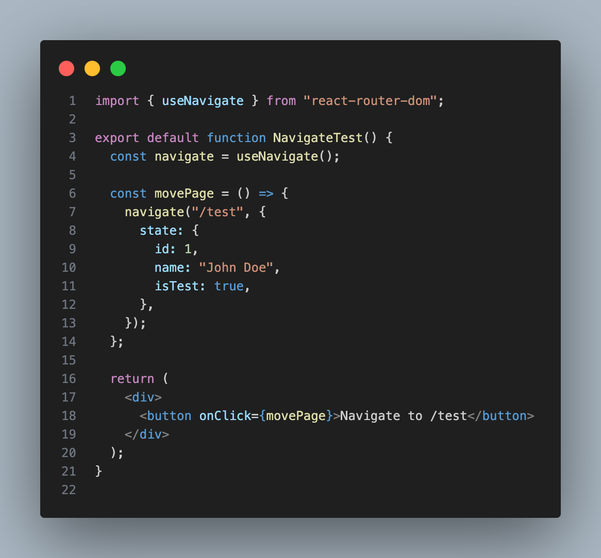
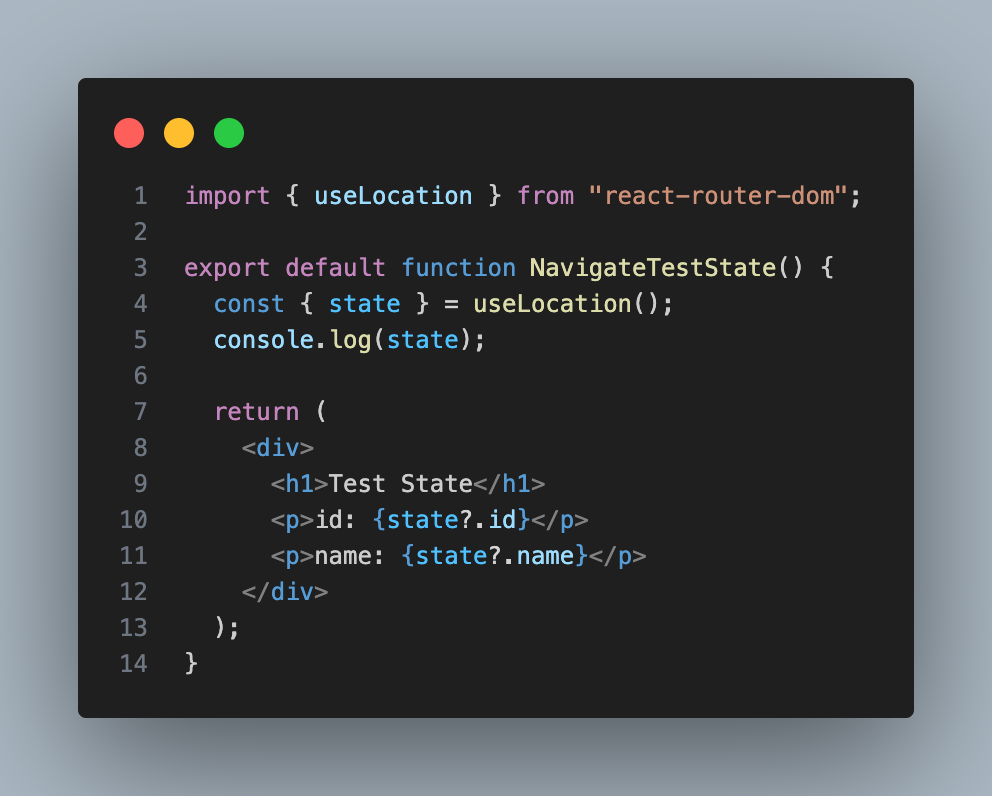
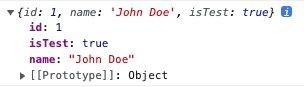

### useNavigate()

**useNavigate()**는 리액트 라우터에서 페이지를 이동할 때 사용된다.

개발을 진행하다 보면 페이지를 이동할 때 특정 값을 같이 이동하는 페이지에 전달해 주고 싶은 경우가 생기는데, navigate() 함수를 사용하면 우리가 원하는 값을 전달할 수 있다.

**우선 navigate() 함수는 두 개의 인자 값을 받는다.**

1. 이동 경로
2. 옵션 { replace 여부, state, relative }

여기서 우리는 2번째 인자 값에 **state**를 이용하면 된다.

### useLocation()

navigate()에서 보낸 **state 값은 useLocation()을 통해 받을 수 있다.**

_
console.log
_

#### 정리

[useNavigate() 공식자료 - React Router](https://reactrouter.com/en/main/hooks/use-navigate#usenavigate){:target="\_blank"} 
[useLocation() 공식자료 - React Router](https://reactrouter.com/en/main/hooks/use-location#uselocation){:target="\_blank"} 

피드백은 언제나 환영입니다. 😊
